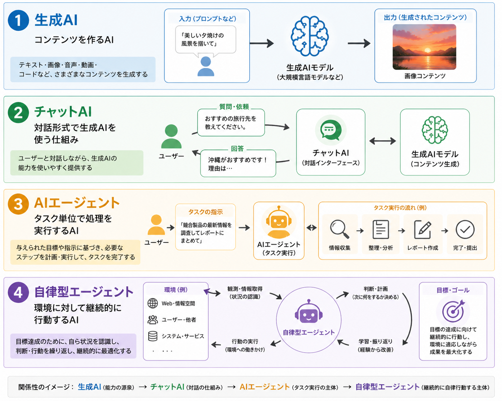
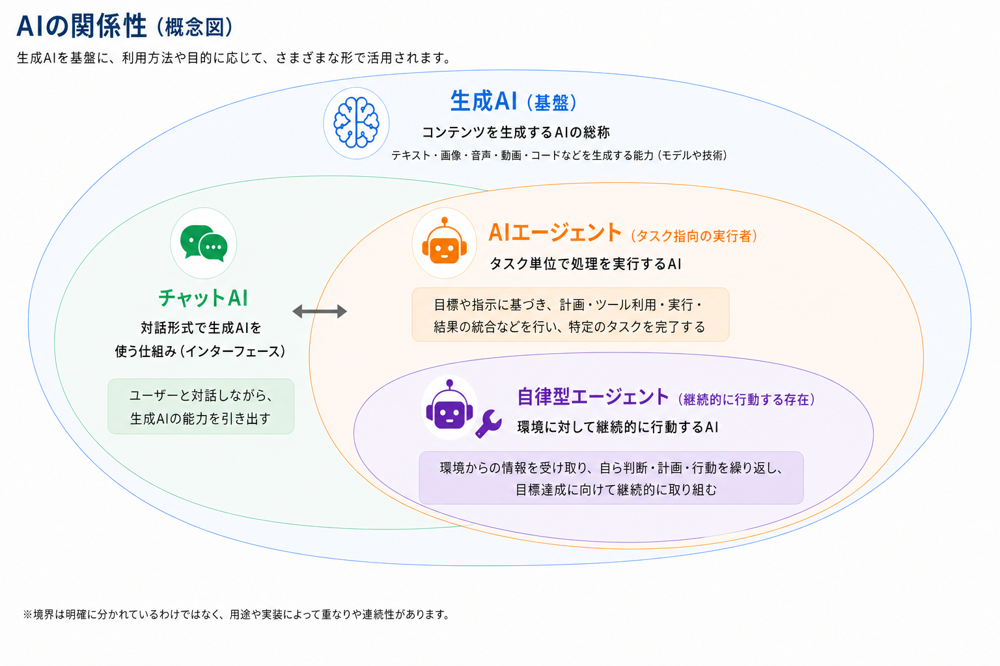

---
html:
  embed_local_images: true
  embed_svg: true
  offline: true
  toc: true
export_on_save:
  html: true
---

# 生成AI・チャットAI・AIエージェントの違い

今日はAIを利用するうえで混同しやすい、生成AI・チャットAI・AIエージェントについての話題です。

## 結論

### 一言でいうと

- 生成AI: 文章、画像、音楽、動画、コードなどのコンテンツを作るAIの総称
- チャットAI: 対話形式で生成AIを利用する仕組み
- AIエージェント: 目標に対して、計画・調査・コマンド実行・コード修正などを進めるAI
- 自律型エージェント: ブラウザ操作やPC操作など、人間の操作領域まで含めて継続的に行動するAI

### もう少し具体的にすると

AI関連の言葉は、似ているようで少しずつ指している範囲が違います。

- 生成AIは、何かを「生成する」AIの総称である。
- チャットAIは、生成AIを会話形式で使うための形である。
- AIエージェントは、単に回答するだけでなく、作業の計画や実行まで行う。
- 自律型エージェントは、より広い権限を持ち、人間の操作に近い領域まで担う。

つまり、単に「AI」と呼んでいても、実際にはできること・任せてよい範囲・注意すべきリスクが異なります。

## 各要素の詳細

### 生成AIの理解

生成AIは、文章、画像、音楽、動画、コードなどを作るAIの総称です。  
代表的な用途としては、以下のようなものがあります。  

- 文章作成, 要約
- 翻訳
- コード生成
- 画像, 音楽, 動画生成

生成AIとは「チャットできるAI」だけを指す言葉ではありません。  
画像生成AIや音楽生成AIなどコンテンツを生成するAI全般を指します。  

### チャットAIの理解

チャットAIは、ユーザーが文章で質問し、それに対してAIが会話形式で回答する仕組みです。  
ChatGPTやClaude,Geminiのようなサービスが分かりやすいと思います。  

チャットAIは、以下のような用途に向いています。  

- 調べものの補助
- 文章の下書き
- 要約
- アイデア出し
- コードの相談
- エラー内容の整理

ただし、チャットAIは基本的に「回答するAI」です。  
利用者が質問し、AIが答えるという関係が中心です。  

そのため、実際のファイル操作、コマンド実行、複数手順の作業管理まで任せる場合は、次に説明するAIエージェントの領域に入っていきます。

### AIエージェントの理解

AIエージェントは、ユーザーの指示に対して、計画を立て、必要な情報を確認し、ツールを使いながら作業を進めるAIです。  
特にコーディング分野では、以下のような作業を行うものが増えています。  

- 既存コードの調査
- 修正方針の提案
- ファイル編集
- テスト実行
- コマンド実行
- エラー原因の調査
- 修正後の再確認

チャットAIが「相談相手」に近いのに対して、AIエージェントは「作業者」に近い存在です。

:::note
ただし、AIエージェントに任せられるからといって、すべてを任せてよいわけではありません。  
ファイル編集やコマンド実行を伴うため、誤った変更、不要なファイル削除、意図しない依存関係の追加、機密情報の混入などに注意が必要です。
:::

### 自律型エージェントの理解

自律型エージェントは、AIエージェントよりもさらに広い範囲で、自律的に判断しながら行動するものです。  
たとえば、以下のような操作を含む場合があります。  

- ブラウザを操作する
- Webサービスにログインする
- PC上のアプリケーションを操作する
- 複数のサービスをまたいで処理する
- 目標に向けて継続的に作業する

AIエージェントとの違いは、単に「できることが多い」だけではありません。  
AIに与えられる権限と、自律的に判断する範囲が飛躍的に広いです。  

そのため、便利になる一方で、以下のようなリスクも大きくなります。  

- 意図しない操作をする
- 間違った判断で処理を進める
- 機密情報を外部サービスに入力する
- 認証情報や個人情報を扱ってしまう
- 人間が途中経過を把握しにくくなる

:::note
私個人の考えですが、  
現時点では業務利用はおろか個人で利用する場合も、特に慎重な運用が必要だと思います。  
:::

## 実務で困るポイント

### よくある誤解

以下のような誤解が起きているケースを目にすることがあります。  

- 生成AIとチャットAIを同じ意味で使ってしまう
- チャットAIをAI全体のことだと思ってしまう
- AIエージェントを単なる高性能チャットAIだと思ってしまう

AIについて話す際は、お互いの認識を揃えておくと話がスムーズです。  

:::info
AI関連の変化するスピードは凄まじいので、言葉の定義が変化することがあります。  
また、各個人が関わるコミュニティによっても定義が異なる可能性もあります。  
「絶対にこれが正解」というモノでもないので、その場に応じた認識のすり合わせをしましょう。  
:::

### AIエージェントの注意点

ローカルPCで動いているツールだから、データも外部送信されていないと思ってしまうことがあります。  
しかし、実際にはクラウド上のAIモデルを利用していることが多いです。  
この場合、入力したコード、ログ、設計情報、エラーメッセージなどがインターネット経由で外部サービスに送信される可能性があります。  

「自分のPCで操作している」ことと、「完全にローカルで処理されている」ことは別の話になるので注意しましょう。  

### 使い方の指針

以下のように使い分けると分かりやすいです。

1. 文章作成、要約、相談、調査補助であれば、チャットAIを使う。
1. コード修正やテスト実行など、作業を進めさせる場合は、AIエージェントを使う。
1. ブラウザ操作、PC操作、外部サービス操作まで任せる場合は、自律型エージェントとして特に慎重に扱う。
1. 機密情報、個人情報、顧客情報、認証情報は、入力してよい環境か必ず確認する。

:::caution
AIの便利さは非常に大きいですが、権限を与えるほどリスクも大きくなります。  
特にAIエージェントや自律型エージェントを利用する場合は、「何をさせるか」だけでなく、「何をさせてはいけないか」も明確にしておく必要があります。
:::
