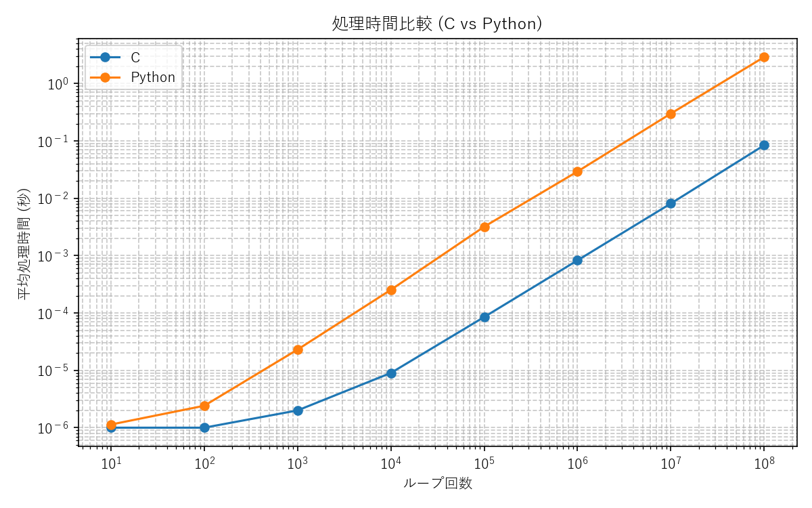
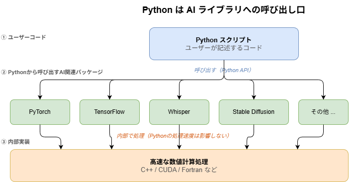

---
html:
  embed_local_images: true
  embed_svg: true
  offline: true
  toc: true
export_on_save:
  html: true
---

# Why use Python in AI project

<!-- @import "[TOC]" {cmd="toc" depthFrom=1 depthTo=3 orderedList=false} -->

<!-- code_chunk_output -->

- [Why use Python in AI project](#why-use-python-in-ai-project)
  - [目的](#目的)
  - [第一の疑問](#第一の疑問)
    - [前提となる疑問](#前提となる疑問)
    - [簡単な答え](#簡単な答え)
  - [第二の疑問](#第二の疑問)
    - [遅いPythonでなぜ?](#遅いpythonでなぜ)
  - [終わり](#終わり)

<!-- /code_chunk_output -->

## 目的

今日はPythonがAI関連のプロジェクトで多く利用される理由の一端の紹介です。  
分かりやすいポストを見かけたので共有です。

:::caution
極力一般論となるよう意識していますが、**個人**の考えです。  
何かを代表しての意見でもないです。  
案件や一緒に仕事をするチームによって扱いが異なる可能性もあります。  
上記ご承知おきください。
:::

## 第一の疑問

### 前提となる疑問

まず前提です。  
一度でもAI関連(※)の検証やツールを試したことがある人は知っていると思います。  
これらのいずれもPythonから利用するのが入り口となっています。  

:::note
※ PyTorchでもPosenetでもWhisperでもStableDiffusionでもなんでも。
:::

自分で実行したことがなくとも、ネット上の記事で目にしたことがある人もいると思います。  
その多くがPythonのインストールやpipコマンドによるライブラリの追加から始まっていたでしょう。  

この前提を知っている人や、これから知っていく人も、「なぜプログラミング言語は数多くあるのに、Pythonばかりが利用されるのだろう」と思うことになります。  

:::note
最近はPythonを使うのが当たり前になりすぎて疑問を抱く人は減っているかもしれませんね。  
もっと言うと、SaaSの利用が主流になったので今更AI利用環境そのものを構築する機会が減っていそうですが…。
:::

### 簡単な答え

シンプルに答えると以下が理由です。

- ライブラリが豊富
- 小規模な制御を試すフットワークが軽い

Pythonのエコシステムではシンプルなコマンドで外部のライブラリを簡単に導入できます。  
そして、構文がシンプルな言語であるため、プログラムのことをあまり知らなくても簡単に試せるのです。  

人と雑談する時に口頭で伝えるなら、上記のような内容を話します。

## 第二の疑問

### 遅いPythonでなぜ?

さて、少しプログラミングをかじっている人なら、C言語に比べてPythonが遅いことは知っていると思います。  
実際遅いです。  
次に湧く疑問が、「なぜPythonが遅いのに計算量が膨大なAIで利用するのか?」です。  

#### Pythonの遅さ

Pythonの処理速度が遅い実例を示します。  
単純な処理をn回繰り返した時の処理時間は下表のようになります。  

No. | ループ回数[回] | C言語での平均処理時間[秒] | Pythonでの平均処理時間[秒] |
--- | ---: | ---: | ---: |
1 | 10 | 0.000001 | 0.000001 |
2 | 100 | 0.000001 | 0.000002 |
3 | 1,000 | 0.000001 | 0.000023 |
4 | 10,000 | 0.000008 | 0.000252 |
5 | 100,000 | 0.000081 | 0.002954 |
6 | 1,000,000 | 0.000855 | 0.027463 |
7 | 10,000,000 | 0.008769 | 0.299589 |
8 | 100,000,000 | 0.081065 | 2.733176 |

グラフ化すると処理回数に比例して処理時間が増えていることが良く分かると思います。  
※ ループ回数の最小と最大で処理時間に大きな開きがあるので対数グラフを用いています。  



この結果より、1,000回程度の単純な処理でも数値上の差が明確化してきます。  
さらに、10万回程度ともなるとPythonはms単位の処理時間となり、C言語との差が顕著になります。  

:::caution
厳密なベンチマークというわけではないです。  
処理内容によっても変わりますし、必ずしも固定的に30倍近い差があるわけではありません。  
ザックリとした差くらいに捉えてください。  
:::

#### ソースコードのサンプル

計測用ソースのサンプルを記載しておきます。  
ごくシンプルな内容ですが、Pythonを全く知らない人向けにC言語と比較しやすいように掲載です。  
適宜読み飛ばしてもらって構いません。  

C言語のコード例は以下

```c
#include <stdio.h>
#include <time.h>

#define MAX_LOOP 100000000

int main(void) {
    clock_t time_start;
    clock_t time_end;
    double time_taken;
    long long simple_calc = 0;
    long long num_of_loop = 0;

    /* 計測開始 */
    time_start = clock();

    /* 単純な処理を繰り返す */
    for (num_of_loop = 0; MAX_LOOP > num_of_loop; num_of_loop++) {
        simple_calc += num_of_loop;
    }

    /* 計測終了 */
    time_end = clock();

    /* 結果出力 */
    printf("結果: %lld\n", simple_calc);
    time_taken = (double)(time_end - time_start) / CLOCKS_PER_SEC;
    printf("処理時間: %f 秒\n", time_taken);

    return 0;
}
```

Pythonのコード例は以下

```python
import time

MAX_LOOP = 100000000


def main():
    # 計測開始
    time_start = time.process_time()

    # 単純な処理を繰り返す
    simple_calc = 0
    for num_of_loop in range(MAX_LOOP):
        simple_calc += num_of_loop

    # 計測終了
    time_end = time.process_time()

    # 結果出力
    print("結果:", simple_calc)
    print("処理時間:", time_end - time_start, "秒")


if __name__ == "__main__":
    main()
```

#### それでもなおPythonを使う理由

Pythonの遅さが分かったところで、なおさらPythonを使う理由が不思議になったでしょう。  

その答えは変わらず、Pythonから利用できるライブラリが豊富だからです。  
Pythonは数多あるライブラリの呼び出し口を担います。  
Pythonからは単にライブラリの機能を呼び出すだけであり、主たる計算処理はPythonではなくその先のライブラリで実施します。  

実質的にPythonが遅いデメリットが発生しない構造となっているのです。



:::info
厳密に言えば Whisper と Stable Diffusion は PyTorch を内部で使っている。  
よって完全な横並びとは言えないが、Pythonから呼び出すという視点に限定して図を単純化している。  
:::

## 終わり

まとめておきます。

- 最初の疑問: AI界隈でPythonが利用されることが多いのはなぜか?  
  - 答え: Pythonにはライブラリが豊富だから  

- 次の疑問: なぜ遅いPythonを利用するのか
  - 答え: 役割を分担しており、膨大な処理を実行するのはPythonではないから。

最後に、冒頭の注意事項を再掲しておきます。

:::caution
極力一般論となるよう意識していますが、**個人**の考えです。  
何かを代表しての意見でもないです。  
案件や一緒に仕事をするチームによって扱いが異なる可能性もあります。  
上記ご承知おきください。
:::
