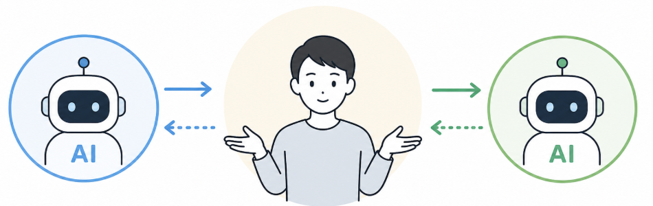

---
html:
  embed_local_images: true
  embed_svg: true
  offline: true
  toc: true
export_on_save:
  html: true
---

# 「AIが書いてAIが読む」時代に、人間が書く意味ってなんだろう

## 相手もAIなのでは？

最近、こんなことを感じるようになりました。  

自分がAIを使ってメールの文面を整える。相手もAIを使って届いたメールを要約する。  
自分がAIに報告書を書かせる。上司もAIに報告書を要約させる。  

人間同士が会話しているように見えて、実はAIとAIが会話しているだけになっていると感じるシーンが増えています。  
もはや人間がAI間を取り持つインターフェースでしかないだろうと。  

大げさに聞こえるかもしれませんが、思い当たる場面はないでしょうか？  

## 「AIが週報をつまらなくした」

先日、Findy社のCEO山田氏がこんな記事を公開していました。  

> [AIが週報をつまらなくした。週報のフォーマットを大幅改訂しました](https://note.com/yuichiro826/n/na3673744543d)

ザックリ以下のような内容です。  

- 全社員に書いてもらっている週報にAIで生成されたものが増えてきた
- カレンダーの予定やタスク管理ツールの内容をまとめただけの長文が並ぶようになり、読むのが苦痛になった

これにより、本来求めていた以下のような要素が失われたとしています。  

- 現場でしか拾えない気づきや、その人がどう考えたか
- 当人にしか書けない一次情報

## なぜ「つまらなく」なるのか

AIは情報を整理するのが得意です。  
箇条書きにまとめる、要点を抽出する、丁寧な文章に仕上げる。  
こういった作業は人間より速く、そつなくこなします。  

その一方で、というかそれに伴って、文章は汎化されます。  

誰が書いても同じような表現になる。角が取れて、個性が消える。  
結果として、「読めばわかるけど、読む必要がない文章」が出来上がります。  

「やったこと」を整理するだけなら、カレンダーやタスクツールを直接見ればいいですし、  
それこそAIでもなんでも利用して自動収集・要約させればいい。  

わざわざ人間が文章にする意味は、そこに書いた人の視点が加わるからです。  

その視点が抜け落ちた文章は、どれだけ整っていても読み手にとって価値が薄い。  
そして読み手もAIで要約してしまえば、もはや誰も中身を読んでいない状態が生まれます。  

## 自分の考えと経験こそがAI時代の価値

AIにできないことは何か。  
それは「自分だけが見たこと」「自分だけが感じたこと」「自分だけが考えたこと」を持つことです。  

たとえば以下のような内容です。  

- 今週の打ち合わせで、お客さんがぽろっと言った一言が気になった
- 新しいツールを試してみたら、思ったより使いにくかった
- 後輩に説明していて、自分の理解が曖昧だったことに気づいた

こういう「小さな体験と、そこから考えたこと」が入っているかどうか。  
それが、読む価値のあるアウトプットとそうでないものの分かれ目となります。  

AIで叩き・下書きを作ること自体は悪くありません。  
ただし、そこに自分の視点を載せる一手間を省いた瞬間、その文章は「自分が書いた意味」を失います。  

:::note
いわゆる、AIには体がないから体験が無いといった話です。  
果たして、体を得たAIが感動や経験を得られるのかは分かりませんが。  
:::

## コラム：AIに書かせれば済むなら、その活動自体を見直すとき

ここまで読んで、逆のことを考えた方もいるかもしれません。  

「AIに丸投げしても誰も困らない報告は、そもそも必要なのか？」  

週報に限らず、定例の報告書、形骸化した議事録、誰も読まない手順書など様々です。  
AIに書かせればそれで済んでしまう業務があるなら、それは人間がやる必要がない作業という信号かもしれません。  

AIの登場は、業務を効率化するだけでなく「この仕事は本当に必要か？」を問い直す機会でもあります。  

やめるべきものはやめる。  
残すなら、人間が関わる意味のある形に変える。  

Findyの事例はまさにこれで、「週報をやめる」のではなく「人間が書く価値のある形に変えた」という話でした。  
