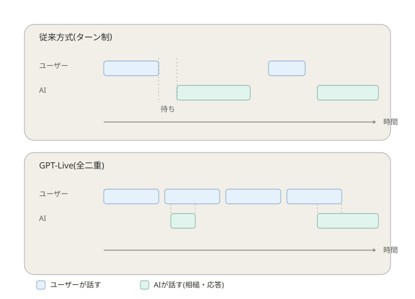

---
html:
  embed_local_images: true
  embed_svg: true
  offline: true
  toc: true
export_on_save:
  html: true
---

# AIと会話する

## きっかけ

2026年7月8日(現地時間)、OpenAIが新しい音声モデル「GPT-Live」を発表しました。  
同日から「ChatGPT」のモバイル・Web版へ順次展開されています。  
「人間らしく、自然な会話」を目指して設計されたモデルとのことです。  

今回はこの記事をきっかけに、AIとの会話について整理します。  

:::source
OpenAI「Introducing GPT-Live」
<https://openai.com/index/introducing-gpt-live/>

窓の杜「ChatGPTの音声対話、"ターン制"は終了。普通の会話のようにテンポ良く話せる「GPT-Live」登場」
<https://forest.watch.impress.co.jp/docs/news/2123665.html>
:::

## これまでの音声AIが抱えていた課題

これまでのChatGPTの音声機能には、大きく2つの世代がありました。

1つ目は、音声認識・言語モデル・音声合成という3つのモデルを順番につなぐ方式です。  
モデル間で情報が失われたり、応答が遅く不自然になったりする課題がありました。  

2つ目は、それらを1つのモデルにまとめた方式です。  
応答は滑らかになったものの、依然として「相手が話し終えるのを待ってから応答する」というターン制が残っていました。  
沈黙を手がかりに「話し終わったタイミング」を判定する仕組みだったため、ちょっとした間や雑音を話し終わりと誤認識し、不自然なタイミングで割り込んでしまうことがありました。

## GPT-Liveで何が変わったのか

図にすると、両者の違いは以下のようになります。

GPT-Liveは、話を聞きながら同時に応答も組み立てられる「全二重」の仕組みで作られています。  
一問一答のやり取りをするのではなく、入力を継続的に処理しながら出力を生成し続ける形です。  

これにより、「話す」「聞き続ける」「間を置く」「割り込む」といった判断を、1秒間に何度も行えるようになりました。  
相槌を打ちながら聞いたり、考え込んでいるときは口を挟まずに待ったりと、実際の会話に近い振る舞いができるようになったとされています。  

:::note
自分が試した際も、こちらの発言の途中で相槌が入ったり、相手に割り込んで次の話題を振ったりと、以前の音声対話とは体感がかなり違いました。
:::

## 会話を止めずに「考える」仕組み

もう1つの特徴は、会話を続けながら裏側で別のモデルに処理を任せる仕組みです。  
検索や複雑な推論が必要な場面では、会話用のGPT-Liveがその場をつなぎながら、裏側でより高度なモデル(現時点ではGPT-5.5)に処理を委譲し、結果が出たら会話に組み込みます。  

会話のテンポを保ったまま、必要な場面では「じっくり考える」処理も行える、という構成になっているのが特徴です。

## 音声ならではの安全対策も

音声対話は文章のやり取りと違い、リアルタイムに進む点が特有のリスクにもなります。  
そのため、GPT-Liveでは音声向けの安全対策も強化されています。  

- 会話中に問題のある応答を検知した場合、より安全な方向へ誘導したり、リスクが高い場合は会話自体を終了したりする仕組みがある
- 実在する人物の声を模倣できないよう、利用できる声はあらかじめ用意されたものに限定されている
- 10代のユーザー向けに、保護者による利用可否の設定や、リスクの高い状況での通知機能が用意されている

:::info
なお、現時点では映像や画面共有を伴う音声対話には対応しておらず、言語によっては発音や流暢さに課題が残る場合もあるとのことです。
:::

## 試すときに意識したいこと

会話が自然になったからといって、油断してよい点が増えたわけではありません。  
音声でのやり取りも、文章のやり取りと同じように、内容はサーバー側に送信・保存されています。  

OpenAIのヘルプセンターでも、音声チャットの音声クリップについて、初期設定ではモデルの学習には使われないものの、共有をオンにすると学習に利用される場合があると説明されています。  
また、学習に使わない設定にしていても、会話自体は一定期間システム上に保存される点は文章でのやり取りと同様です。  

:::source
OpenAI Help Center「音声モード FAQ」
<https://help.openai.com/ja-jp/articles/8400625>

OpenAI Help Center「ChatGPT のチャットおよびファイルの保持ポリシー」
<https://help.openai.com/ja-jp/articles/8983778>
:::

音声は文字と違って「打ち込む」という一手間がないぶん、話しているうちについ愚痴や悩み事、社内の込み入った事情まで話してしまいやすい面があります。  
文字にすると一度立ち止まって見直せますが、音声はその場のノリで口に出てしまいやすく、「記録に残っている」という感覚が薄れがちです。  

業務に関わる情報や個人情報はもちろん、何気ない愚痴や相談ごとも、音声だからといって気軽に話してよいわけではありません。  
文章でのやり取りと同じ意識を持っておくとよさそうです。  

:::caution
業務でのAI利用は各所属のルールに従ってください。
ここで紹介した内容は、個人でAIを試す際の参考としてください。
:::

しばらくは「AIと自然に雑談できる」という体験そのものを楽しみつつ、便利さの裏にある仕組みも少しずつ知っておくと、この先AIとの付き合い方を考えるときの土台になるはずです。
