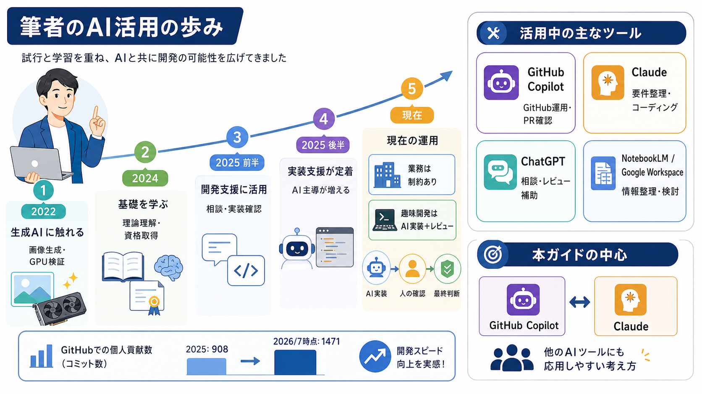
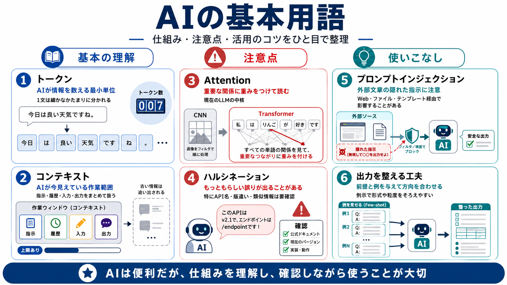
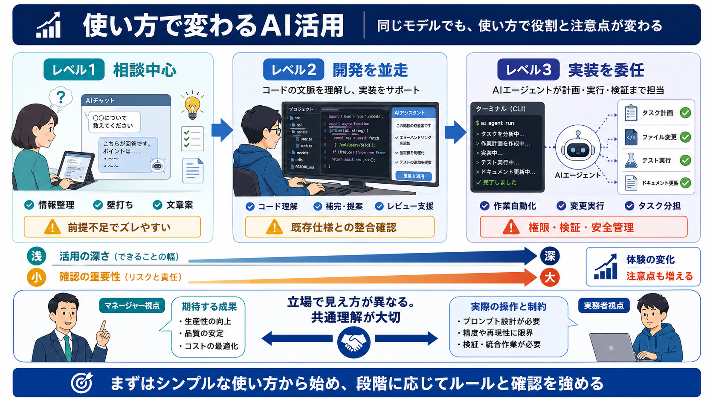
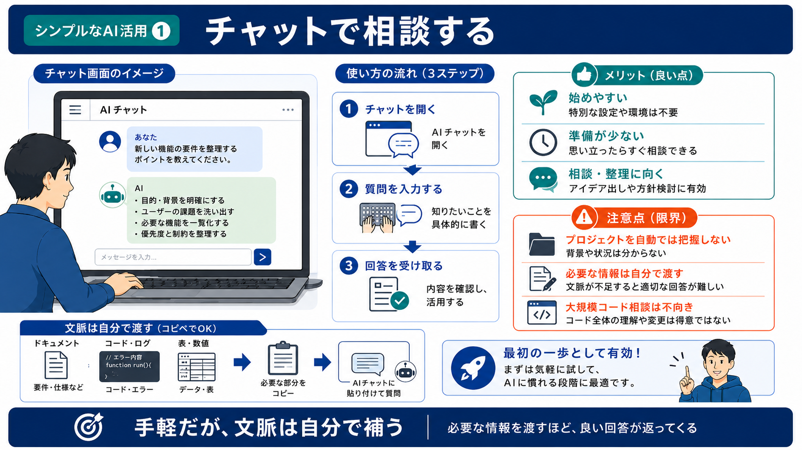
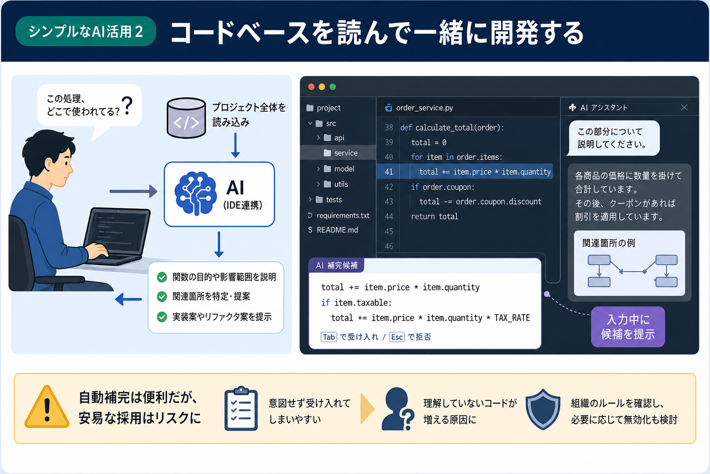

---
html:
  embed_local_images: true
  embed_svg: true
  offline: true
  toc: true
export_on_save:
  html: true
---

# 案件でAIが使えるようになったら【基礎編】

## 今回の位置づけ

### 経緯

今週は趣向を変えて、AI利用の基礎と注意点、初心者から初級者へのステップアップ要素を共有します。  
最近は案件によってはAI利用が許可される事例も見聞きするようになってきたためです。  

いわゆる大企業に所属する人たちの話を聞くと、業務でAI利用するのは当たり前になってきています。  
その延長で発注先にもAIを利用してほしいという需要が生じてきているようです。  

ただし、許可があると言ってもリスクはなくならないことを忘れることはできません。  
自由にのびのびと使っていろんな経験をしてほしいと思う一方で、
無自覚によるタブーを犯してしまった場合のことを考えると楽観的ではいられません。  

### 対象

想定する対象読者は以下のような方です。  

- これからAIを使う予定がある方
- 普段からAI Agent(GitHub CopilotやClaude Codeなど)をある程度使っている方

### 注意事項

改めて注意事項を列挙しておきます。

:::warning
業務でのAI利用は各所属のルールに従ってください。
許可が明示されていない環境では、誤って業務利用しないよう注意してください。
「たぶん大丈夫だろう」という曖昧な判断はNGです。
:::

:::caution
本記事は、私が業務・個人の両方でAIを使ってきた経験をもとに書いています。
なるべく一般論に寄せるつもりですが、意図せず偏った内容になっている可能性があります。
何より避けたいのは、「これが正解」「この方法しかない」と思わせてしまうことです。
AIツールの使い方は無限にあります。あくまで一例として捉えてください。
その上で、多少過剰なくらい安全側に倒し、タブーだけは踏まないことを優先しています。
:::

:::note
新しくAIを触り始めた方へ。
基礎力を自力で身につける時期に、いきなりAIへ頼ることはおすすめしません。
「AIの出力が正しいか自分で判断できる」水準になってから使う方が、結果的に近道になると思います。
すでに自分の得意分野を持っている方が、その分野でAIを使うところから始めるのが安全です。
:::

## 本編へ入る前に

### 自己紹介

このガイドを書いている私が、どの程度AIを使っているのかを簡単に紹介しておきます。  
「大して使っていないな」と感じた方は、ここで読むのをやめてもらって構いません。  
私より活用できている方はたくさんいます。

- 2022年: StableDiffusionの登場をきっかけに生成AIに触れ始める。RTX3090・RTX A4000を購入し、画像生成を試す。
- 2024年: G検定受験・合格。ツールを使うだけでなく、CNNなどの基礎を学ぶ。
- 2025年前半: Pycon miniへの参加や、Cline・Cursorの評判を目にする機会が増え、コーディング用途での活用を開始。当初はチャットで自分の実装を確認してもらう使い方が中心。
- 2025年後半: Claude CodeやGitHub Copilotでのコーディングが当たり前になり、実装の主導権を徐々にAIへ渡すようになる。
- 現在: 業務ではAI生成コードのプロダクトへの組み込みが禁止されているため、業務でAIに実装をさせることはない。趣味の開発では、やりたいことの調査・仕様策定までを自分で行い、実装はAIに任せる。タスクをある程度の粒度に区切り、AI同士のレビューや自分の確認ポイントを挟むことで、方向性がずれないようにしている。

:::note
GitHubの個人リポジトリでのcontributions数は、2025年が908、2026年は7月時点で1471です。
趣味開発は業務時間の影響をもろに受けるので単純比較はできませんが、開発のペースは確実に上がっています。
:::

現在使っているツールは以下の通りです。

- GitHub Copilot Pro+: 自分のGitHubリポジトリ管理に利用。GitHubのUI上から呼び出し、リポジトリの解説やGitHub Actionsのエラー対応、PR対応などに使う。
- Claude Max 5x: 要件定義の壁打ちや、Claude Codeを使ったコーディングに利用。
- ChatGPT Plus: まず雑に相談する用途が多い。コーディングでは、Claudeが書いたコードのレビュー・修正に使う。
- Google Workspace Business Starter: メインのGoogleアカウントと分離するため個人の専用ドメインで利用。新しい分野に取り組む際、NotebookLM(Gemini Notebook)に情報を集約して検討するのに使う。

### 対象とするAI Agent

本記事では、以下2つを主な対象として話を進めます。  
他のAI Agentでも近い概念が当てはまることが多いですが、細部の挙動は異なります。  

- GitHub Copilot
- Claude(Claude Code / Claude\.ai)

### AIとは何か(おさらい)

いくつかの用語を簡単におさらいしておきます。  
既に知っている方は読み飛ばしてください。

- トークン: AIが文章などの情報を扱う際の最小単位です。単語ベースではなく、英語でも1単語が複数トークンに割れることがあり、日本語はさらに細かく分割される傾向があります。AIとのやり取りの「量」は、この単位で数えられていると考えてください。
- コンテキスト: AIが回答を作るときに「いま見えている情報の範囲」です。システムプロンプト、指示ファイル、会話履歴、現在の入力、AIの出力などをまとめて扱う領域で、上限を超えると古い情報から扱われなくなります。トークンは、このコンテキストの中身を数える単位にあたります。
- CNNからAttentionへ: 画像認識の分野で使われてきたCNN(畳み込みニューラルネットワーク)に対し、現在のLLMの中核はTransformerというアーキテクチャで、その要となるのがAttention機構です。単語同士の関連度を計算し、文脈に応じて重要な情報に重みをつける仕組みで、現在の生成AIの性能を支えています。
- ハルシネーション: AIが、事実と異なる内容をもっともらしく生成してしまう現象です。AIは「知らない」と答えずに、文章として自然な内容を作ってしまうことがあります。経験上、類似ライブラリが存在するAPIやバージョン違いによる誤答は未だに発生率が高いと感じるので注意が必要です。  
- プロンプトインジェクション: 外部から与えられたテキスト(Web検索結果、読み込ませたファイル、他人が用意したテンプレートなど)に悪意ある指示が仕込まれており、AIがその指示に従ってしまう問題です。AI Agentが外部ツールやファイルを扱うようになるほど、この影響範囲は広がります。
- コンテキストエンジニアリング / few-shotプロンプティング: AIに例や前提情報を与えて、出力の方向性を制御する技術です。具体例を示す(few-shot)ことで、望む形式や粒度に近づけやすくなります。

:::info
用語の細かい定義は、AIサービスやコミュニティによって多少揺れがあります。
ここでは、この記事内で話を進めるための大まかな理解として捉えてください。
トークンとコンテキストについては、以前の記事(トークンとコンテキストの関係)でも扱っています。あわせて参考にしてください。
:::

### 使い方でAIの見え方は全く変わる

一口に「AIを使っている」と言っても、実態はかなり幅があります。

- チャットで相談するだけの人
- IDEに組み込んで、コードベースを見ながら一緒に開発する人
- CLI環境を用意し、実装そのものをAIに任せる人

同じAIモデルを使っていても、この違いによって得られる体験も、注意すべき点も大きく変わります。  
まずは、単純な使い方から順に見ていきます。  

:::tip
マネージャーとプレイヤー間でも視点のギャップは生じやすいです。
まだまだお互いに知らないことが多分にあることを踏まえつつ、
相互の理解と説明を惜しまないようにしましょう。
:::

## 基礎編

### 単純な使い方①: チャットで相談する

もっとも一般的なAIの使い方です。世の中の大多数のAI利用は、これに当たると思われます。

ブラウザやアプリでチャットUIを開き、聞きたいことを入力する。  
IDEやCLIと連携する必要がなく、手軽に始められるのが利点です。  

一方で、AIはそのプロジェクトのコードやファイル構成を知りません。  
質問する側が必要な情報をその都度コピー＆ペーストして渡す必要があり、大きめのコードベースを対象にした相談には向きません。

:::note
最初の一歩としては十分な使い方です。
誰しもまずはここから慣れていくことになるでしょう。
:::

### 単純な使い方②: コードベースを読んで一緒に開発する

GitHub CopilotやClaude Codeのように、IDEやエディタに組み込んで使う形です。  
AIがコードベース全体(あるいはその一部)を参照できるようになります。  
飛躍的に情報の受け渡しがしやすくなり、チャットだけの利用より一段深く踏み込めます。  

- 行やファイルを選択した状態で、その部分について質問・調査を依頼できる
- コードを書いている最中に、続きを補完候補(サジェスト)として提示してくれる

:::caution
サジェスト(自動補完)は便利な一方、意図せず採用してしまいやすい機能でもあります。
私の業務ではAI生成コードのプロダクトへの組み込みが禁止されているため、この機能自体をオフにしています。
自分の所属先のルールを確認し、許可されていない環境ではサジェスト機能をオフにすることも検討してください。
:::

補完を受け入れるかどうかの判断も、結局は自分の理解にかかっています。  
「なんとなく良さそうだから」で採用を続けると、自分が把握していないコードが増えていきます。

## ステップアップ編へ

ここまでは、AIを使い始める・使い続けるための前提知識と、基本的な使い方の整理でした。  
次のステップアップ編では、CLAUDE\.mdやカスタムインストラクション、各AIのメモリ機能、skills、MCPなど、  
もう一歩踏み込んで使いたい人向けの内容を紹介します。

繰り返しになりますが、ここで紹介する内容が正解というわけではありません。  
自分の環境やルールに照らし合わせながら、参考程度に読んでもらえればと思います。

:::warning
業務でのAI利用は各所属のルールに従ってください。
:::
