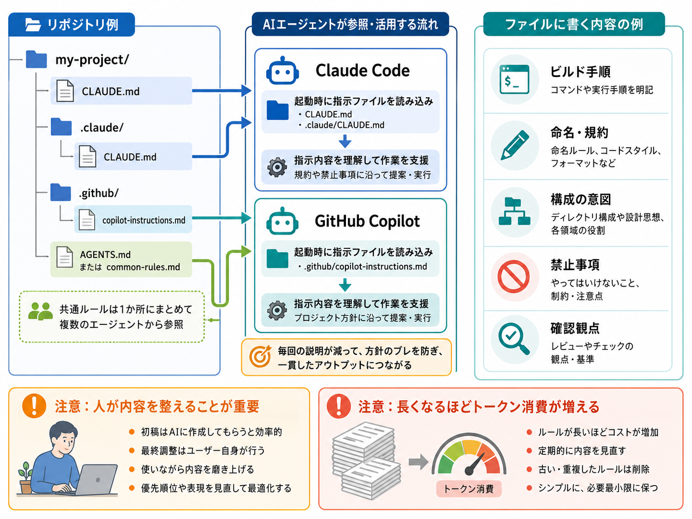
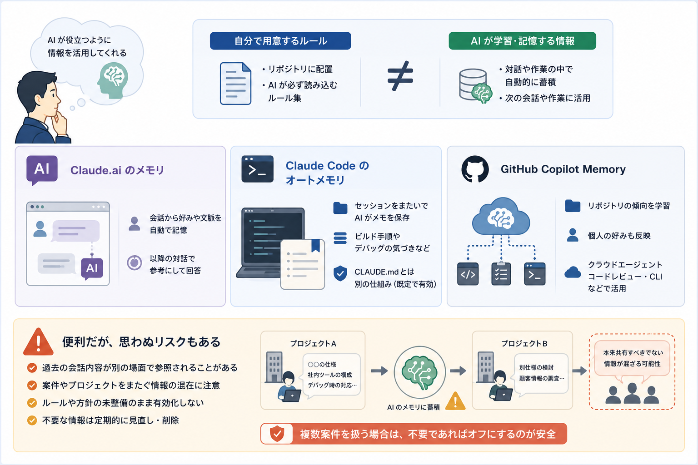
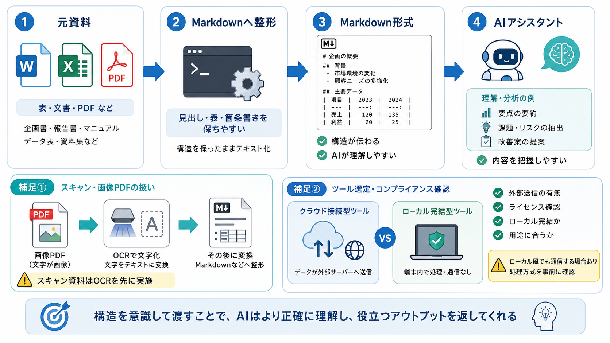
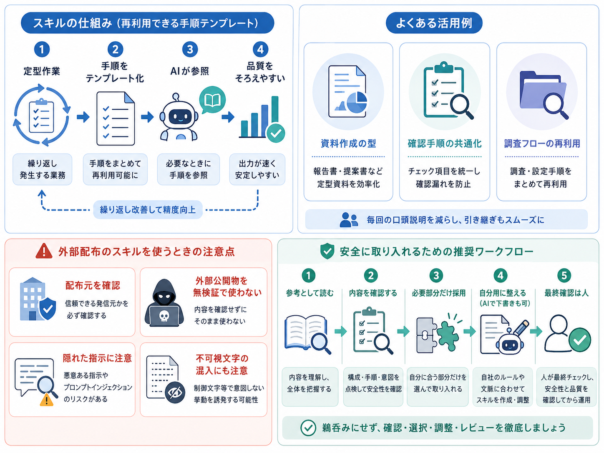
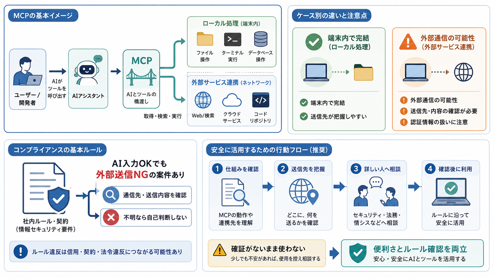
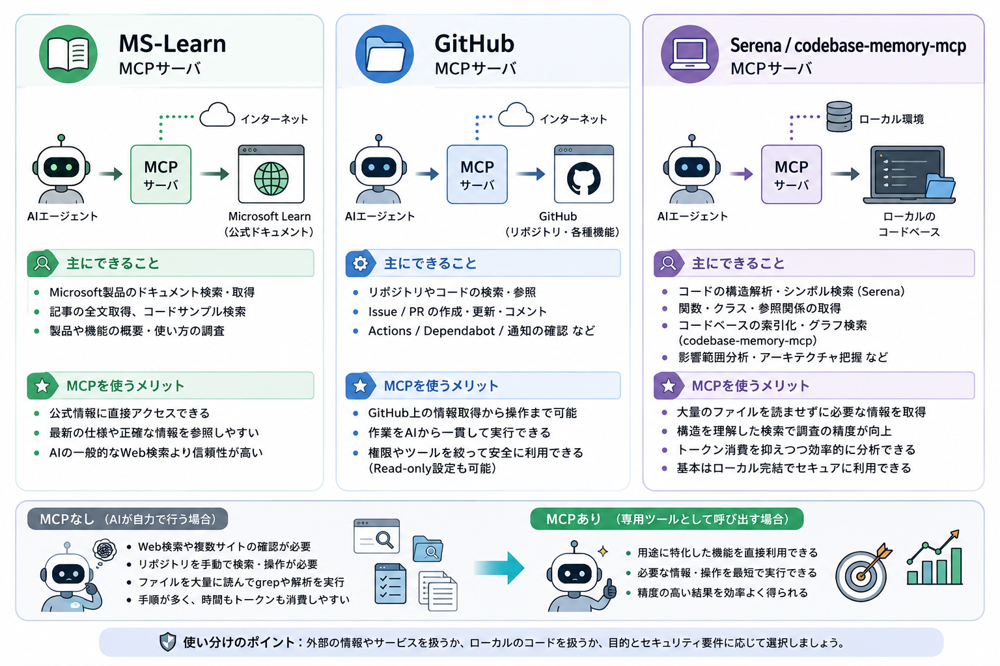
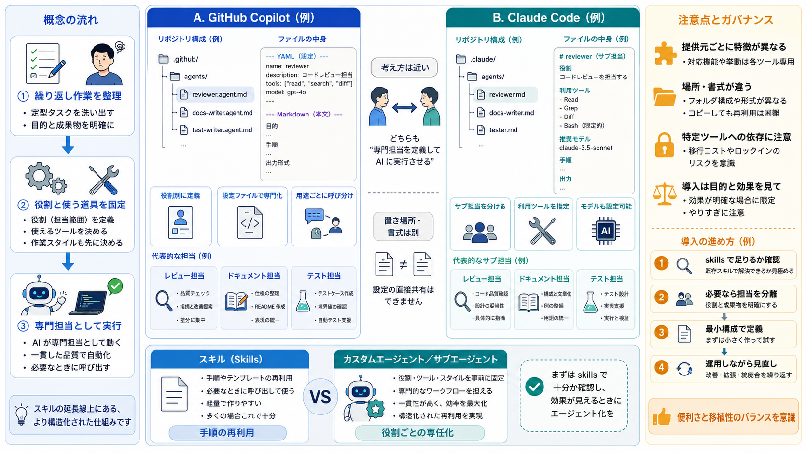
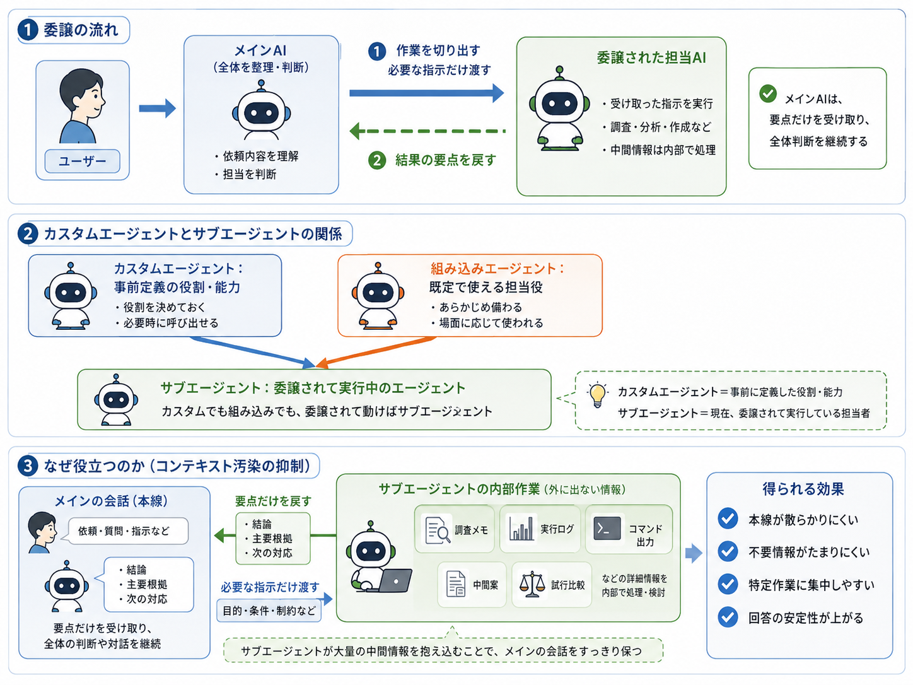
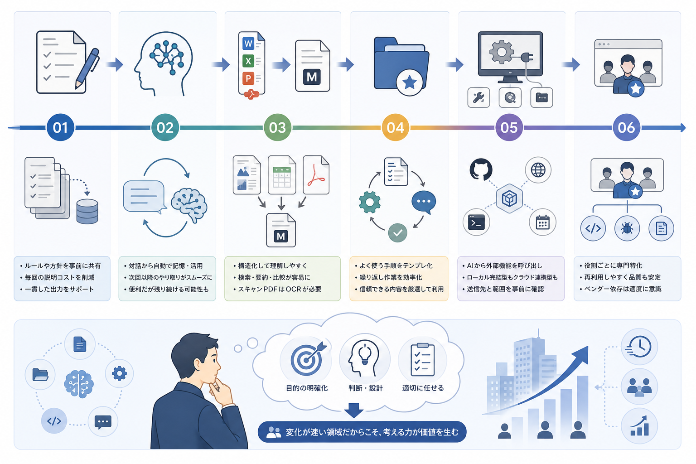

---
html:
  embed_local_images: true
  embed_svg: true
  offline: true
  toc: true
export_on_save:
  html: true
---

# 案件でAIが使えるようになったら【ステップアップ編】

うるさいくらいにリスク記載しています。  
コンプラ問題に直結する内容なためです。  
ご了承ください。  

## 本編へ入る前に

基礎編では、AI利用にあたっての前提知識と、チャット・IDE統合という基本的な使い方を整理しました。  
ステップアップ編ではその続きとして、もう一歩踏み込んで使いたい人向けの内容を紹介します。

派遣先の他部署やオンラインイベントに参加すると、「AIを導入しても思ったより使われない」という声を耳にすることがあります。  
理由の多くは、単に使い方を知らないか、輸出管理や機密情報の制約が強すぎて活用しきれていないかのどちらかだと感じています。  

せっかくAI利用の許可が出た案件で、使い方を知らないまま終わってしまうのはあまりにも惜しいので、今回情報共有します。  
繰り返しになりますが、ここで紹介する内容が正解というわけではありません。  
特定の使い方に固執せず、自分なりに試してみることも大事です。  

:::warning
業務でのAI利用は各所属のルールに従ってください。
外部送信の可否など、判断に迷う場合は必ず確認してから使ってください。
:::

## ステップアップ編

### ステップアップ①: CLAUDE\.md / copilot-instructions\.md

AI Agentに、プロジェクトやチームのルールを毎回説明するのは手間がかかります。  
そこで使われるのが、指示を書いたファイルをリポジトリに置いておく方法です。  

- Claude Code: `CLAUDE.md`(プロジェクト直下でも `.claude/CLAUDE.md` でも同じ扱いで読み込まれます)
- GitHub Copilot: `.github/copilot-instructions.md`

:::tip
GitHub CopilotはAGENTS\.mdやCLAUDE\.md,GEMINI\.mdの読み込みにも対応しています。
複数Agentを利用する場合は何か1つのファイルにルールを書いて、
対応するinstructionsから参照させるようにすると良いでしょう。
:::

いずれも、AIがセッション開始時に読み込む「常に守ってほしいルール」を書いておくファイルです。  
ビルドコマンド、コーディング規約、ディレクトリ構成の意図、やってほしくないことなどを書いておくと、毎回同じ説明を繰り返さずに済みます。

:::caution
ここだけはAIに書かせきりにせず、自分で使いながらチューニングすることをおすすめします。
AIが生成した指示文は一見それらしく見えますが、冗長すぎたり、実際に運用してみると「守ってほしい優先順位」がずれていたりすることがよくあります。
最初はAIに叩き台を作らせてもいいですが、最終的な調整は自分の手で行ってください。
:::

:::warning
前述した通り、これらファイルは必ずAIに読み込まれます。
内容をモリモリ書き込んでいくと、それだけでトークン消費量は増えます。
色々試した後に元に戻すのを忘れないようにしたり、適宜棚卸したりするようにしましょう。
:::

### ステップアップ②: 各AIのメモリ機能

CLAUDE\.mdやcopilot-instructions\.mdが「自分が書くルール」だとすると、メモリ機能は「AIが会話を通じて自動的に覚えていく情報」です。  
両者は似ているようで別物なので、混同しないようにしてください。  

- Claude.aiのメモリ: チャットでのやり取りから、好みや文脈を自動的に記憶し、以降の会話に活用する機能です。
- Claude Codeのauto memory: セッションをまたいで、ビルドコマンドやデバッグ時の気づきなどをClaude自身がメモとして書き残す機能です。CLAUDE\.mdとは別の仕組みです。
- GitHub Copilot Memory: リポジトリの傾向や個人の好みを学習し、Copilotのクラウドエージェントやコードレビュー、CLIで活用する機能です。

:::warning
メモリ機能は便利な一方、「意図せず情報が残り続ける」リスクがあります。
過去のやり取りで触れた内容が、別の文脈で不意に参照されることもあり得ます。
**案件間で本来共有すべきでない情報まで、意図せず暗黙的に共有されてしまう可能性があるため要注意です。**
そもそも許可・禁止どちらの判断も明言されていない、あるいは「便利そうだから」という単純な理由で許可されているだけ、というケースもあり得ます。
自身が複数の案件・プロジェクトをまたいで作業する可能性があるなら、たとえ許可されていてもオフにしておく方が安全です。
:::

:::note
ツール側のメモリ機能に頼るのではなく、
セマンティックなワークスペースを構築する方針を勧めます。
ツールが変わっても活用できますし、人間にとっても扱いやすくなります。
:::

### ステップアップ③: 資料をMarkdown化してから読み込ませる

過去記事でMarkdown・OCRについて触れましたが、実際にAIへ資料を読み込ませる際は、この2つを組み合わせて使う場面が多くあります。

WordやExcel, PDFの資料をそのままAIに渡すより、Markdownに変換してから渡した方が、AIが構造を把握しやすくなります。  
変換ツールは無数にありますが、外部へ情報送信しないことやライセンス周りなど確認して用途に合ったものを選択すると良いでしょう。  

:::tip
画像として保存されたPDF(スキャンしたものなど)は、そのままではテキストが取り出せません。
OCRを別途行う必要がある点は、以前のOCR回で紹介した内容と同じです。
:::

:::info
Microsoftが公開しているオープンソースの変換ツール「MarkItDown」を使うと、コマンド一つでWord・Excel・PowerPoint・PDFなどをMarkdownへ変換できます。
:::

:::caution
変換ツールが内部でクラウドサービスを呼び出す構成になっている場合、そこで外部送信が発生する可能性があります。
「ローカルで動くツールだから安全」とは限らないので、変換ツールの処理方式(完全ローカル完結か、一部で外部サービスを呼ぶ構成か)を確認してから使ってください。
:::

### ステップアップ④: skills

skillsは、繰り返し行う定型作業を、AIが参照できる手順書としてテンプレート化しておく仕組みです。  
「毎回同じような資料を作る」「毎回同じ手順でチェックする」といった作業を、都度言葉で説明せずに済ませられます。

:::caution
配布元には要注意です。
**個人が公開しているようなskillsは、絶対に無検証で使わないで**ください。
プロンプトインジェクションのリスクがあるのは当然として、
不可視文字(見た目には映らない制御文字)が仕込まれ、意図しない指示が混入しているケースもあり得ます。
極論、コピー＆ペーストでの利用も避けたいです。
私が勧めるのは、参考資料として中身を確認し、必要な部分だけを自分で選んで取り込む・AIに頼んでSkill化してもらう、という使い方です。
:::

### ステップアップ⑤: MCP

MCP(Model Context Protocol)は、AIから外部ツールを呼び出せるようにする仕組みです。  
ローカルPC内だけで完結するものもあれば、外部と通信するもの(例: GitHub MCP)もあります。

:::warning
「LLMへの情報入力は許可されているが、外部送信は禁止」というルールの案件は多くあります。
利用しようとしているMCPが、どこにどんな情報を送信する可能性があるか、必ず確認してから使ってください。
自分だけで判断がつかない場合は、いきなり利用を諦めるのではなく、詳しそうな人(情報システム部門や、AIに詳しい同僚など)に確認してみることをおすすめします。
抑止側に倒しすぎて、使えば便利なはずのものを使わずに終わってしまうのも惜しいためです。
とはいえ、**確証が持てないまま自己判断で使う**ことだけは避けてください。
:::

### ステップアップ⑥: カスタムエージェント/カスタムサブエージェント

一定の作業内容・使用ツールをあらかじめ定義しておく、skillsの上位版のような機能です。

- GitHub Copilotには「カスタムエージェント」という機能があり、`.github/agents/` 配下に`<名前>.agent.md`という設定ファイル(YAML frontmatter + Markdown本文)を置くことで、役割ごとに専門化したエージェントを定義できます。
- Claude Codeにも同等の「カスタムサブエージェント」機能があり、`.claude/agents/`配下に`<名前>.md`を置く形で、役割・使用ツール・モデルを定義できます。

:::info
GitHub Copilotが「カスタムエージェント」と呼ぶものと、Claude Codeが「カスタムサブエージェント」と呼ぶものが、ほぼ同じ役割を担います。
設定ファイルの置き場所やfrontmatterの書式も異なるため、丸ごと流用はできません。
:::

skillsで実現できる内容も多いため、無理にカスタムエージェント化する必要はありません。  
また、特定のベンダーでしか使えない機能に依存しすぎると、以前の記事(Fable 5が来て、3日で止まった)で触れたような「ツールが急に使えなくなる」場面で困りやすくなります。  
利用すること自体は問題ありませんが、依存度は意識しておいた方がよいです。  

### ステップアップ⑦: サブエージェント

サブエージェントは、メインエージェントが別のエージェントへ作業を委譲する実行方式です。  
組み込みのサブエージェントが使われる場合もあれば、あらかじめ定義したカスタムエージェントがサブエージェントとして呼び出される場合もあります。  

カスタムエージェントが「役割や能力の定義」を指すのに対し、サブエージェントは「メインエージェントから委譲されて動作しているエージェント」を指します。  
手軽に呼び出すことができ、メインの会話に無関係な調査結果や中間出力を混ぜ込まずに済むため、コンテキスト汚染(本来不要な情報が文脈に溜まり、回答の精度が落ちること)を抑える効果があります。

## おわり

ここまで、CLAUDE\.md・メモリ機能・Markdown化・skills・MCP・カスタムエージェントと、段階的に紹介してきました。  
共通しているのは、どれも「AIに文脈をどう持たせるか」という工夫だという点です。  

この分野は変化が速く、今回紹介した内容も数か月後には形を変えているかもしれません。  
大事なのは個別の機能を覚えることよりも、「何のために何をAIに任せるのか」を自分の頭で考えられるようにしておくことだと思っています。  
今回の内容が、AI活用のとっかかりになれば幸いです。

