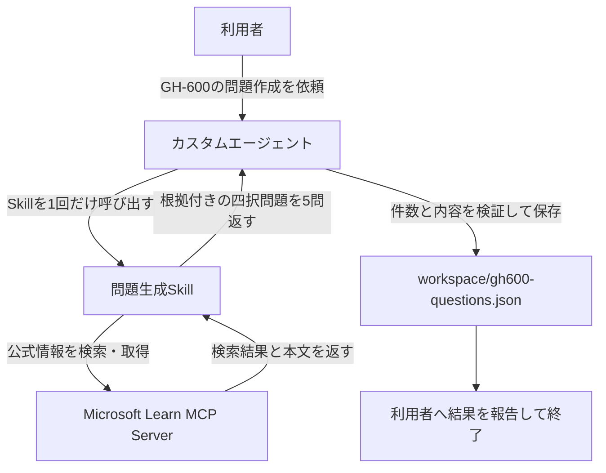
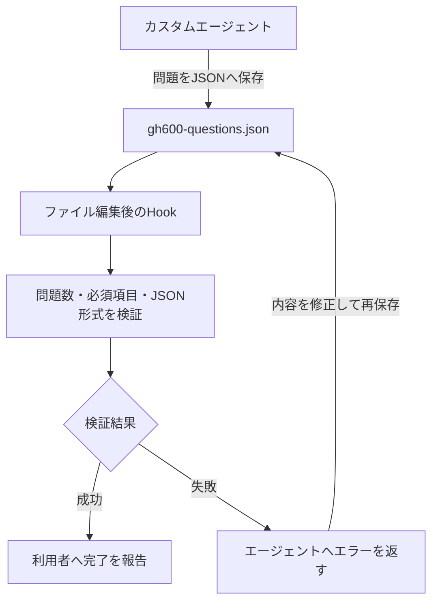

---
html:
  embed_local_images: true
  embed_svg: true
  offline: true
  toc: true
export_on_save:
  html: true
---

# 案件でAIが使えるようになったら【追加編】

## 追加編

ステップアップ編の内容からさらにもう少し踏み込んだ内容を紹介します。  
その前に、デモを1つ紹介します。  

### ここまでの紹介の組み合わせ

| 構成要素 | デモでの役割 |
| --- | --- |
| MCPサーバ(Microsoft Learn MCP Server) | GH-600に関係する公式情報の検索と本文取得 |
| Agent Skill | MCPを利用し、根拠付きの四択問題を5問生成 |
| カスタムエージェント | Skillを1回だけ呼び出し、生成結果を検証して保存・報告 |

処理の流れは次の通りです。

### ハーネスとは何か

このデモでは、AIモデルに「GH-600の問題を作って」と頼むだけではありません。  
カスタムエージェントが作業を受け付け、Skillに書かれた手順に従い、MCPサーバから公式情報を取得し、結果を検証してファイルへ保存します。  

このように、AIモデルを実際の作業で動かすために周囲へ用意する仕組み全体を、**AIエージェントハーネス**と呼びます。  
ハーネスは特定の製品機能を指す言葉ではなく、AIに何を見せ、何を使わせ、どのような手順で実行し、結果をどう確認するかをまとめた実行環境です。  

今回のデモをハーネスの構成要素として整理すると、次のようになります。

| 観点 | デモで該当するもの |
| --- | --- |
| 指示 | カスタムエージェントとAgent Skillに記述した役割・手順 |
| 知識・コンテキスト | Microsoft Learn MCP Serverから取得した公式情報 |
| ツール | MCPサーバ、ファイル操作 |
| オーケストレーション | カスタムエージェントからSkillを呼び出す処理の流れ |
| 検証 | 問題数、選択肢、根拠などの確認 |
| 成果物 | `workspace/gh600-questions.json` |

ステップアップ編で紹介したinstructions、メモリ、Skill、MCP、カスタムエージェントは、それぞれ独立した小技ではありません。  
組み合わせてAIが作業しやすい環境を整えることが、ハーネスを設計するという考え方につながります。  

:::info
同じAIモデルを利用していても、ハーネスによって使える情報やツール、作業手順、検証方法が異なれば、得られる結果も変わります。
モデルの性能だけではなく、その周囲をどのように設計するかも重要です。
:::

### Hooks

Hooksは、AIエージェントの処理中に特定のタイミングでコマンドやスクリプトを実行する仕組みです。  
たとえば、ツールの実行前、ファイル編集後、タスクの終了時などに、あらかじめ決めた処理を差し込めます。  

instructionsへ「JSONを保存したら検証してください」と書く方法もありますが、これはAIに対する指示です。  
一方、Hooksを使えば「ファイル編集後に検証スクリプトを起動する」という処理自体を実行フローへ組み込めます。  
AIの判断だけに任せたくない定型処理を、決まったタイミングで呼び出せる点が大きな違いです。  

代表的な利用例は次の通りです。

- ツール実行前: 危険なコマンドや、対象外ディレクトリへの書き込みを検出する
- ファイル編集後: フォーマッター、Lint、テスト、JSON Schemaによる検証を実行する
- タスク終了時: 未完了の項目や検証漏れがないか確認する
- セッション終了時: 実行結果や監査用ログを保存する

先ほどのデモへ「生成したJSONをHooksで検証する」処理を加える場合は、次のような流れになります。

この構成では、問題を作る部分はAIに任せつつ、成果物が決めた形式を満たしているかはスクリプトで機械的に確認できます。  
AIに柔軟な判断を任せる部分と、同じ基準で繰り返し検証する部分を分けることで、作業の再現性を高められます。  

:::caution
Hooksの対応イベント、設定ファイル、受け取れる情報はAIエージェントごとに異なります。
また、Hooksは決められた処理を起動する仕組みであり、それだけで安全性を保証するものではありません。
外部から受け取った文字列をそのままコマンドへ渡さない、機密情報をログへ出力しない、失敗時の扱いを決める、といったスクリプト側の設計も必要です。
:::

## おわり

ハーネスは、AIモデルの周囲にある指示、知識、ツール、処理手順、検証方法を含めた全体の仕組みです。  
Hooksはその中で、決まったタイミングに検証などの処理を組み込む役割を担います。  

最初から大がかりなハーネスを作る必要はありません。  
繰り返し説明しているルールをinstructionsやSkillへ移し、必要な情報をMCPで取得し、実行漏れを避けたい検証をHooksへ移す、というように少しずつ整えるとよいでしょう。  
