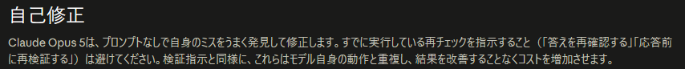
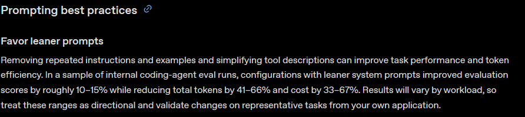

---
html:
  embed_local_images: true
  embed_svg: true
  offline: true
  toc: true
export_on_save:
  html: true
---

# その一言、まだ必要ですか

## きっかけ

7月に入り、各社から新しいAIモデルが相次いで公開されました。

| 一般提供開始日(現地時間) | 提供元 | モデル |
| --- | --- | --- |
| 2026年7月9日 | OpenAI | GPT-5.6 |
| 2026年7月21日 | Google | Gemini 3.6 Flash |
| 2026年7月24日 | Anthropic | Claude Opus 5 |

性能の比較はあちこちで語られているので、ここでは別の話をします。  
モデルが新しくなると、性能だけでなく「AIへの頼み方」も少しずつ変わる、という話です。  

## 前提：今までの使い方でも大丈夫

新しいモデルが出たからといって、普段の使い方をすべて覚え直す必要はありません。

Anthropicの説明でも、Claude Opus 5はClaude Opus 4.8向けに書かれた既存の指示でも、良好に動作するとされています。

これまでどおり、やってほしいことを普通に伝えれば利用できます。  
今回の内容は、「いつもの一言を外した方が、うまくいく場合もある」という程度の話です。  

読んで気が向いたら試す、くらいに捉えてください。

## 昔の一言が、足を引っ張ることがある

### 再確認をお願いする一言

AIに何か頼むとき、末尾に決まり文句を添えている人は多いと思います。  

- 「間違いがないか、もう一度確認してください」
- 「回答する前に見直してください」
- 「最後に検証してください」

Claude Opus 5向けの説明では、このような再確認の指示を避けるよう案内されています。

Claude Opus 5は、指示されなくても自分の誤りを見つけて修正するとされています。  
そこへ再確認を重ねて指示すると、使用量やコストが増える一方で、結果は改善しないとされています。  

親切のつもりで加えた一言が、同じ作業を重ねて頼む形になっているわけです。  

:::source
Anthropic「Prompting Claude Opus 5」
<https://platform.claude.com/docs/en/build-with-claude/prompt-engineering/prompting-claude-opus-5>
:::

### 減らした方が良くなることもある

OpenAIのGPT-5.6向けガイドでも、指示を簡素にすることが勧められています。

見直す候補として挙げられているのは、次のようなものです。

- 同じ指示の繰り返し
- 目的のない例示
- 作業に関係のない道具やツールの説明
- モデル自身に任せられる細かな手順

OpenAIの社内評価では、指示を簡素にした構成の方が、評価スコアが約10～15%高くなりました。  
同時に、使用トークンは41～66%、コストは33～67%少なくなったと報告されています。  

:::info
この数値は、開発者がAIエージェントを組む際の設定を対象にした社内評価の結果です。
OpenAI自身も「作業内容によって変わるため目安として扱い、自分の環境で確認してほしい」と注記しています。
チャットで一言添えるかどうか、という話にそのまま当てはまる数字ではありません。
ただし「指示を減らした方が結果が良くなる場合がある」という方向性は参考になります。
:::

:::source
OpenAI「Prompting guidance for GPT-5.6 Sol」
<https://developers.openai.com/api/docs/guides/prompt-guidance-gpt-5p6>
:::

## 同じ言葉でも、モデルによって向きが違う

「簡潔に答えてください」  

よく使われる一言だと思います。  
私もGPT-5.5を利用するときには、よく添えていました。  
この一言について、OpenAIとAnthropicは異なる説明をしています。  

GPT-5.6は、GPT-5.5よりも既定の回答が簡潔になりました。  
OpenAIは、「簡潔に」「短く」といった指示がまだ必要か確認するよう案内しています。  
不要になっている場合もあれば、指示を残すことで回答が短くなりすぎる場合もあるためです。  

一方、Claude Opus 5は、以前のOpusモデルより回答が長くなる傾向があります。  
Anthropicは、回答を短くしたい場合は、明示的に簡潔さを指示するよう案内しています。  

同じ「簡潔に」という一言でも、モデルによって効果が異なります。  
一度覚えた決まり文句を、すべてのモデルに同じように使う必要はないということです。

## 各社が向かっている方向

同時期に公開されたGemini 3.6 Flashも、少ないトークンとやり取りで同じ作業を終えられる点を特徴として挙げています。  
細かく指示されなくても、目的が伝われば必要な手順はモデル側が選ぶ。各社の説明は、そろってこの方向を向いています。

:::source
Google「Introducing Gemini 3.6 Flash, 3.5 Flash-Lite, and 3.5 Flash Cyber」
<https://blog.google/innovation-and-ai/models-and-research/gemini-models/gemini-3-6-flash-3-5-flash-lite-3-5-flash-cyber/>
:::

そのため、細かな手順をすべて指定するよりも、次のことを伝える方が重要になってきています。

- 何をしてほしいか
- どの条件を守る必要があるか
- どうなっていれば正解か

## 試せること

一度にすべての頼み方を見直す必要はありません。  
いつも付けている一文を1つだけ外して、同じことを頼んでみてください。  

- 「間違いがないか確認してください」を外す
- 「簡潔に答えてください」を外す

何度か試しても結果が変わらなければ、その一文はもう必要ないかもしれません。

反対に、外したことで結果が悪くなったなら、今も役立っている指示です。  
その場合は、これまでどおり残せば問題ありません。  

:::caution
ここで挙げた具体例は、各社が公開している特定のモデル向けの説明に基づくものです。
モデルごとに事情が異なるため、他のモデルにそのまま当てはまるとは限りません。
気になる場合は、使っているモデルの公式ドキュメントを確認するのが確実です。
:::

:::warning
業務でのAI利用は各所属のルールに従ってください。
ここで紹介した内容は、個人でAIを試す際の参考としてください。
:::

## おわりに

新しいモデルが出るたびに、新しい技を覚え直す必要はありません。  

これまでどおり、やってほしいことを伝えれば、AIは利用できます。  
そのうえで、モデルが入れ替わったときには、いつも添えている一言が今も必要か、一度だけ試してみる。  
今回伝えたかったのは、それくらいの話となります。  
