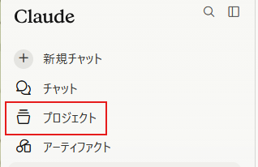
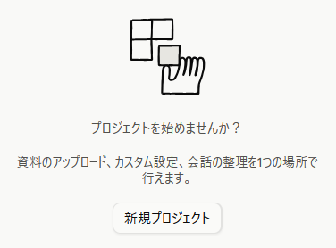
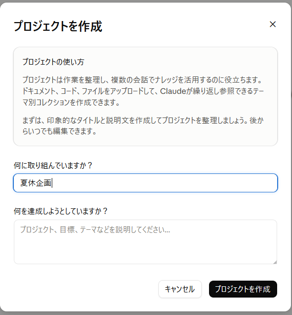
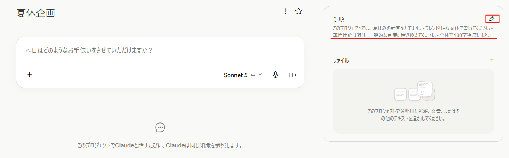
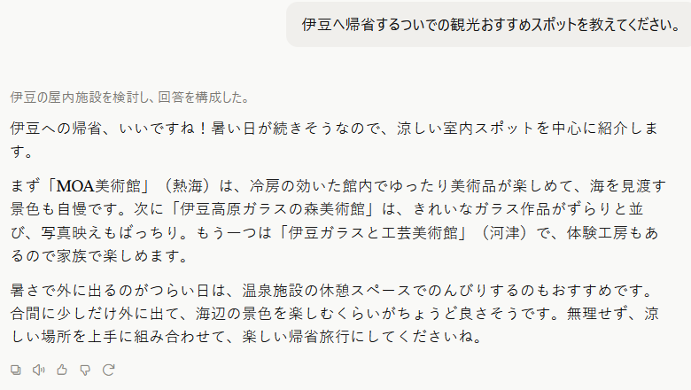

---
html:
  embed_local_images: true
  embed_svg: true
  offline: true
  toc: true
export_on_save:
  html: true
---

# 夏休み、暇があったら実践してみる？

## はじめに

もうすぐ夏休みです。休みましょう。  

旅行、帰省、趣味、何もしない贅沢。過ごし方は自由です。  
今回の内容も、業務とは一切関係ありません。読んでも読まなくても、やってもやらなくても構いません。  
「休みの合間に、10分だけ手が空いたら」くらいの温度感で捉えてください。  

やることは、チャットAIの設定をほんの少し触ってみることです。  
特別な準備は要りません。普段使っているアカウントがあれば、それだけで足ります。  

## なぜ、一度だけ触っておくとよさそうか

AIは、あくまで道具のひとつです。  
今この瞬間に業務で使えるかどうかとは別の話として、これから先、AIを使っている人と一緒に仕事をする場面は増えていきます。

そのとき、細かい使い方を知っている必要はありません。  
ただ、一度でも自分で触ったことがあれば、相手の話していることが何のことか分かります。  
逆に一度も触れたことがないと、同じ言葉を聞いても、頭の中に絵が浮かばない可能性があります。  

今回まず試すのは、その「一度触ったことがある」を作るための、ごく小さな作業です。  
プロジェクトを一つ作るところまでできれば十分です。メモリの確認は、余裕があればやってみてください。

:::note
本記事はClaudeの画面を例に説明します。
特別な理由があるわけではなく、説明を1つに絞った方が分かりやすいためです。
同じことはChatGPTやGeminiでもできるので、普段使っているサービスに読み替えて構いません。
:::

## 毎回、同じ説明をしていませんか

### チャットAIは、会話が変わると前提を忘れる

チャットAIに何かを頼むとき、毎回同じ前置きを書いていないでしょうか。

- 「専門用語は使わずに説明してください」
- 「家族向けの案内なので、丁寧な言い回しでお願いします」
- 「私は暑さが苦手なので、屋内中心で提案してください」

通常の新しい会話を始めるたびに、AIから見える情報の範囲は空の状態に戻ります。  
そのため、前回伝えたはずの前提も、もう一度書かなければ伝わりません。

この「毎回書いている前置き」を、あらかじめ置いておける場所があります。

### プロジェクトを作って、指示を書く

多くのチャットAIには、テーマごとに作業場所を分ける機能があります。  
Claudeでは「プロジェクト」と呼ばれています。

プロジェクトには「プロジェクト指示」を書いておくことができ、そのプロジェクトの中で始めた会話には、その指示が毎回自動的に適用されます。

Claudeのプロジェクトは、無料アカウントを含むすべてのユーザーが利用できます。無料の場合、作成できるプロジェクトは最大5つまでです。

:::source
Anthropicヘルプセンター「プロジェクトとは何ですか？」
<https://support.claude.com/ja/articles/9517075>
:::

:::note
いわゆるカスタムインストラクションと類似した機能の紹介となります。
PCが無くとも実践できるように、プロジェクト機能を利用して紹介しています。
:::

### やってみる

手順は3つだけです。

1. サイドバーからプロジェクトを新規作成する  
  

1. 名前を付ける（「夏休企画」など、何でも構いません）  

1. プロジェクト指示に、プロジェクトで共通利用したい前提を書く  

指示の例を挙げておきます。

:::sample
このプロジェクトでは、夏休みの計画をたてます。
・フレンドリーな文体で書いてください
・専門用語は避け、一般的な言葉に置き換えてください
・全体で400字程度にまとめてください
・猛暑が予想されるので、極力屋内を提案してください。
:::

書けたら、そのプロジェクトの中で新しい会話を開いて、条件を一切書かずに頼んでみてください。

:::sample
伊豆へ帰省するついでの観光おすすめスポットを教えてください。
:::

条件を書いていないのに、フレンドリーで、専門用語を避けた、400字程度の文章が返ってくるはずです。  
これが、前提を預けておくということです。

:::tip
うまく反映されないと感じたら、プロジェクト指示を短くしてみてください。
条件を詰め込みすぎると、どれを優先すべきかが曖昧になり、かえって外れやすくなります。
:::

:::info
ChatGPTにも同名の「プロジェクト」機能があり、無料プランで利用できます（無料の場合、1プロジェクトにつき5ファイルまで添付可能です）。
Geminiでは「Gem」がこれに近く、個人のGoogleアカウントがあれば作成できます。
:::

:::source
OpenAI Help Center「ChatGPT のプロジェクト」
<https://help.openai.com/ja-jp/articles/10169521-projects-in-chatgpt>

Gemini アプリ ヘルプ「Gemini アプリで Gem の使用を開始する」
<https://support.google.com/gemini/answer/15236321?hl=ja>
:::

## 頼んでいないのに、覚えている

### メモリという仕組み

前提を預ける方法は、もうひとつあります。  
ただしこちらは、自分で書くのではなく、AIが会話から自動的に拾って覚えていくものです。

Claudeでは「メモリ」と呼ばれる機能で、無料・Pro・Maxの各プランで利用できます。  
覚える対象として案内されているのは、次のような内容です。

- 担当している役割や、仕事の背景
- やり取りの好みや、進め方の傾向
- 技術的な好み
- 進行中の作業の詳細

一度覚えられると、次の会話から自動的に反映されます。  
毎回説明する手間が減る一方で、「いつ、何を覚えたか」を自分では意識していない状態になります。

:::info
プロジェクトごとに、独立した記憶の領域が用意されています。
あるプロジェクトでの内容が、別のプロジェクトやプロジェクト外の会話へそのまま持ち込まれることはありません。
:::

### やってみる

こちらは、作るのではなく見るだけです。

設定画面のメモリの項目を開くと、AIが現時点で何を覚えているかが一覧で表示されます。

使い始めたばかりであれば、ほとんど何も入っていないはずです。  
しばらく使っている場合は、思っていたより具体的な内容が並んでいて、少し驚くかもしれません。  

一覧は、そのまま眺めるだけで構いません。  
「自分が明示的に伝えたわけではない情報が、ここに溜まっている」と分かれば十分です。

:::info
メモリ機能は現在、新旧2つの仕組みが並行して提供されています。
設定画面のどこに項目があるか、画面に表示される名称や細かな挙動は、どちらが適用されているかによって異なります。
本記事は、設定の中に「メモリ」の項目がある場合を前提に書いています。
:::

:::source
Claude Help Center「Use Claude's chat search and memory to build on previous context」
<https://support.claude.com/en/articles/11817273-use-claude-s-chat-search-and-memory-to-build-on-previous-context>
:::

## 「自分で書いたもの」と「AIが覚えたもの」

ここまでで、2つの仕組みを触りました。  
どちらも「毎回説明しなくて済む」という同じ結果をもたらしますが、性質はかなり違います。

| | プロジェクト指示 | メモリ |
| --- | --- | --- |
| 誰が書くか | 自分 | AIが自動で拾う |
| 効く範囲 | そのプロジェクトの中だけ | 会話全体（プロジェクトごとに領域は分かれる） |
| 中身の把握 | 自分で書いたので把握できる | 見に行かないと分からない |
| 消し方 | 書き換える・プロジェクトを消す | 個別に削除、または一括リセット |

違いをひとことで言えば、**範囲を自分で決めたかどうか**です。

プロジェクト指示は、自分で書いて、自分で置き場所を決めています。  
メモリは便利ですが、範囲を決めているのは自分ではありません。

たとえば、旅行の相談用プロジェクトと読書の相談用プロジェクトを分ければ、それぞれの会話で覚える内容も混ざりにくくなります。

## 覚えたものは、どう消えるか

便利な機能ほど、止め方と消し方を知っておくと安心して使えます。  
メモリについては、次の手段が用意されています。

- **一時停止**: 今ある内容は保持したまま、新しく覚えることをやめる
- **リセット**: すべてのメモリを完全に削除する（プロジェクトのメモリも含みます。取り消しはできません）
- **個別削除**: 一覧から特定の項目だけを選んで消す

会話中に「これは覚えておいて」と伝えて追加することもできます。

ひとつ、知っておくと役に立つ点があります。

:::caution
会話そのものを削除しても、そこから作られたメモリの項目は自動では消えません。
消したい場合は、メモリの一覧から個別に削除する必要があります。
「チャットを消したから残っていないはず」とは限らない、ということです。
:::

また、履歴にもメモリにも残さずに話したいときのために、一時的な会話を開く手段も用意されています。  
Claudeではシークレットチャットと呼ばれ、すべてのプランで利用できます。  
プロジェクトの外で新しい会話を開くと画面右上にアイコンが表示され、そこから開始できます。  
この状態でのやり取りは、履歴にもメモリにも保存されません。

:::warning
業務でのAI利用は各所属のルールに従ってください。
ここで紹介した内容は、個人でAIを試す際の参考としてください。
:::

:::caution
プロジェクト指示にもメモリにも、業務情報・顧客情報・個人情報は入力しないでください。
一度書いた内容は、以降の会話へ自動的に持ち込まれます。
「毎回説明しなくて済む」ということは、「毎回持ち出される」ということでもあります。
:::

## おわりに

今回やったことは、2つだけです。

- 前提を書いておける場所を作って、そこで一度頼んでみた
- AIが何を覚えているかを、自分の目で見た

派手な使い方ではありませんが、「AIに前提をどう持たせるか」という考え方そのものは、サービスが変わっても通用します。  
名前や画面の位置が変わっても、やっていることは同じだからです。

もちろん、夏休み中にやる必要はまったくありません。  
休むことが最優先です。

暇を持て余したときにでも、思い出してもらえたら嬉しいです。  
事件・事故に気を付けて、よいお休みを。  
