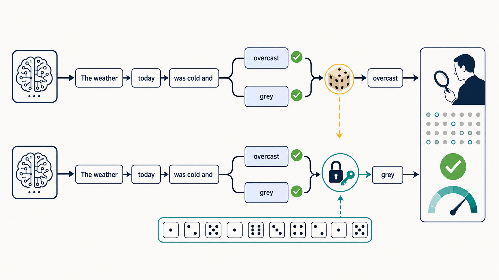

---
html:
  embed_local_images: true
  embed_svg: true
  offline: true
  toc: true
export_on_save:
  html: true
---

# AIが選んだ言葉に印が残る

## きっかけ

2026年8月14日、AnthropicがClaudeの生成するテキストに電子透かし（ウォーターマーク）を埋め込む仕組みを公開しました。

EU AI Actの透明性義務への対応が理由です。  
ただし適用範囲はEU域内にとどまらず、日本を含む全世界のモデルとプロダクトに及びます。

「出力に何か仕込まれる」と聞くと、トークンを余分に消費するのか、品質が落ちるのかが気になります。  
結論として、追加のトークン消費はなく、速度への影響もごくわずかです。  
品質・内容・読みやすさについても、従来と同等の水準とされています。  
その理由は、AIの文章生成の仕組みそのものと直結しているので、今回はその仕組みを整理します。  

:::source
Anthropic「How Claude's text watermark works」
<https://www.anthropic.com/news/claude-text-watermark>

ITmedia NEWS「「Claude」の“見えない透かし”、Anthropicが仕組みを説明」
<https://www.itmedia.co.jp/news/article/2608/16/2000000555/>
:::

## 結論

今回の仕組みは「文章の中に見えない文字列を紛れ込ませる」タイプの仕組みではないようです。

- テキストへの文字列追加や、隠し文字の挿入とは異なる方式
- 追加のトークン消費がないため、料金は従来と同じ
- 速度への影響はごくわずか。品質・内容・読みやすさへの影響は確認されていない
- 読者が文章から透かしの有無を見分けるのは困難
- 透かしや鍵に含まれるのは、利用者・組織・チャットを特定する情報とは異なるもの

## 仕組み

### サイコロを差し替えることで実現する

LLMは、文章を1トークンずつ順番に選びながら生成します。

Anthropicが挙げている例は「The weather today was cold and（今日の天気は寒くて）」という文です。  
次に来る語が「sugary（砂糖の）」である可能性は極めて低いです。  
その一方で「overcast」と「grey」（どちらも曇りを表す語）は、どちらが続く可能性もありえますし、どちらであっても読み手にとって意味はほとんど変わらないです。  

こうした「どちらでもいい選択」は、長い文章の中に何度も現れます。通常、この選択は乱数で決められています。

透かしは、この乱数の生成源を差し替えます。  
任意の乱数生成器の代わりに、秘密鍵と直前の数語から乱数を作ります。  
選ばれる語はランダムのままですが、鍵を持つ側が単語の並びを検証すると「この鍵で選んだ場合と整合するか」を確認でき、Claudeが関与した確率を測れる、という仕組みになります。  

サイコロを振る代わりに、決まった数字の列(例えば円周率の抜粋)を順番に使っていくようなものです。  
出目の並びはランダムに見えますし、ゲームも同じように進みます。  
ただし後から並びを照合すれば、その列を使ったかどうかが分かります。  

:::info
Claudeの透かしは、Google DeepMindが2024年にNature誌で発表した「SynthID-Text」を基にした方式です。
Anthropic独自の発明ではなく、業界で共有されている考え方に沿ったものです。
:::

:::note
語の選ばれ方には、従来と同じようにばらつきがあります。
また、普段なら選ばないような珍しい語を選ばせるものでもない、と明記されています。
選択肢の中身は変えず、選び方の乱数だけを差し替えるのがポイントです。
:::

### 透かしが入りにくいところ

仕組み上、「どちらでもいい選択」が少ない文章では、透かしを入れられる余地も限られます。

- 事実の記述: 「吾輩は猫である……」に続く語は実質的に1つです。ここで別の語を選べば、単に間違いになります。
- 数式: 「2＋2＝」の次に来る語も同様です。
- プログラム: 別の語を選ぶと動作が変わる場面は対象外です。コード内のコメントのように、任意の選択が可能な部分に限って使われます。

つまり、コーディングでAIを使っている場合、生成されるコード本体への影響はごく限られます。

もう一つの制約が、文章の長さです。  
単語選択の回数が少ない短文では透かしが入る場面が少なく、長文になればなるほど透かしが入りやすくなります。  

### 校正・編集・翻訳で変わること

同じ「AIを使って書いた」でも、関与の仕方によって結果が変わります。  
ここは混同しやすいので、方向を分けて整理します。  

- 人間が書いた文章をAIが校正した場合  
透かしはAIが選んだ語に潜みます。  
文法や句読点だけを直す校正では、ほとんどの語が人間のものなので、透かしが入りにくいと言えます。  

- AIが書いた文章を人間が編集した場合  
Anthropicは「軽い編集ではおそらく完全には消せないが、全ての単語を置き換える完全な書き直しをすれば消える」としています。  
そしてその場合は、もはやAI生成と呼べるかどうか議論の余地がある、とも付け加えています。

- 翻訳  
全ての単語をAIが選ぶため、透かしが入ります。

## 限界と、変わらないこと

透かしが示せる範囲は限定的です。

- 分かるのは「Claudeが何らかの形で関与した可能性」までです。  
「Claudeが書いた」のか「Claudeが大幅に編集した」のかは区別できない
- 人間が書いたことの証明にはならない
- 他社のAIモデルが生成したかどうかも判別できない

Anthropicが近く提供予定のAPIを使えば、検出することもできるようです。  
実装の詳細は現在調整中とされており、現時点では誰もが判定できる状態ではないです。  

また、8月2日より前にリリースされた既存モデルには法律上の経過措置があり、透かしの追加は今後数か月かけて展開される方針となっています。

そして、透かしが入った後も、出力の所有権や法的責任は従来と同じです。  
利用規約上の権利も従来どおりです。  

:::info
画像などのファイル（.png、.jpg、.svgなど）は別方式です。
ファイルのメタデータに、作成・処理の来歴を記録する業界標準規格「C2PA」準拠の署名付き記録が付与されます。
カメラメーカーや写真編集ソフトが使っているものと同じ規格で、ファイル自体への埋め込みとは異なる方式です。
:::

## 透かしは判断材料の一つ

利用者から見ると、料金や文章の読みやすさをほぼ変えずに、AIの関与を後から確かめる手掛かりが加わることになります。  
ただし、透かしから分かるのは、Claudeが何らかの形で関与した可能性までです。  
生成元や人間の関与を断定する証明ではなく、判断材料の一つとして捉えるのがよさそうです。  
