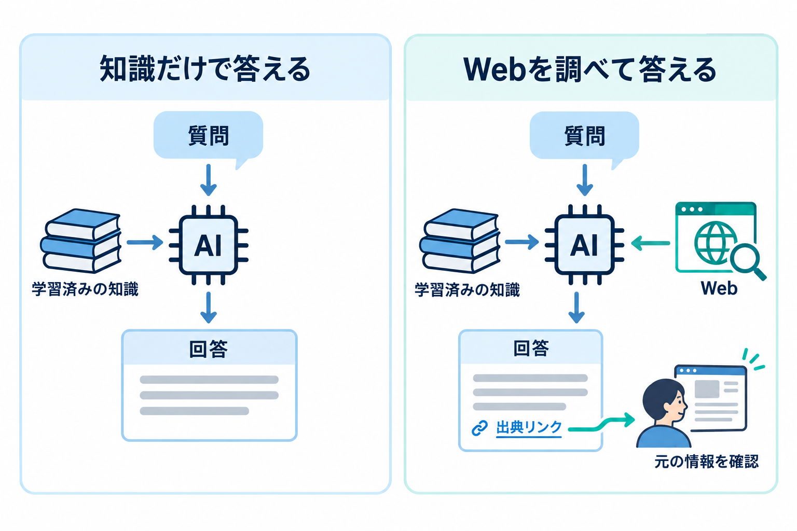

---
html:
  embed_local_images: true
  embed_svg: true
  offline: true
  toc: true
export_on_save:
  html: true
---

# AIさん、裏取りしてる？

## きっかけ

### トラフィックの半分以上が、人間以外に

2026年8月6日に行われたCloudflareの決算説明会にて、CEOのマシュー・プリンス氏が次のように発言しました。  

> 人類の歴史上初めて、第2四半期に当社のネットワークを流れたトラフィックの50%超が、人間によるものではなくなった。

こうした機械的なアクセスの中には、チャットAIが回答を作成するためにWebを調べに行くトラフィックも含まれています。  
一見すると遠い世界の話のように思えるかもしれませんが、普段利用するチャットAIの裏側でも、まさに同じことが起きています。  

今回は、この「AIが調べてから答える」仕組みについて、身近な視点から整理します。  

- AIが答える前にWebを調べに行く仕組みとその効果
- AIが実際に調べてから答えたのかどうかを確かめる方法
- もし調べていなさそうな場合の頼み方

:::source
・More Than Half of Cloudflare's Network Traffic Is No Longer Human.（The Motley Fool、2026年8月7日）
<https://www.fool.com/investing/2026/08/07/more-than-half-of-cloudflares-network-traffic-is-n/>
:::

### 数字の補足

CloudflareはWebサイトの配信やセキュリティを支える米国のインフラ企業であり、世界中の数多くのWebサイトが同社のネットワークを経由しています。  
なお、冒頭の数字はあくまで同社のネットワーク内で観測された範囲のものであり、インターネット全体を網羅した統計ではありません。  

プリンス氏は同じ説明会の場で、AIエージェントによるリクエストが増え続けている点についても言及しました。  
また同氏は2026年3月のインタビューにおいて、「人間がカメラを1台購入する際にはせいぜい5サイト程度を比較するのに対し、AIエージェントはその1,000倍にあたる5,000サイトものページを参照することもある」といった例えを紹介していました。  

:::source
・Online bot traffic will exceed human traffic by 2027, Cloudflare CEO says（TechCrunch、2026年3月19日）
<https://techcrunch.com/2026/03/19/online-bot-traffic-will-exceed-human-traffic-by-2027-cloudflare-ceo-says/>
:::

## AIは答える前に調べに行く

### 覚えている知識に、調べた情報を足す

一般的なAIは膨大なテキストデータから学習していますが、その学習が完了した時点より後に起きた出来事は、基本的に知識として持っていません。  
そのため従来のAIでは、直近の出来事に関する質問に対して「答えられない」としたり、事実とは異なるもっともらしい回答（いわゆるハルシネーション）を返してしまったりすることがありました。  

しかし現在のチャットAIの多くは、質問を受け取ったあとに自らWebを検索し、見つかったページを参照しながら回答を組み立てられるようになっています。  
これにより最新の情報を取得できるだけでなく、自身が保持している知識が正しいかどうかを照合する「裏取り」の役割も果たしています。  

人間が何か調べものをする場合、たとえば10〜20サイトを読み比べて情報を整理するだけでも、相応の時間と手間がかかります。  
調べる対象が増えるほど、集中力を保つのも難しくなってきます。  
一方、AIには、こうした情報の収集・整理をまとめて任せることができます。  

こうした検索機能の効果は、開発元の技術レポートなどにも示されています。  
たとえばOpenAIが2025年8月に公開したGPT-5の技術資料（System Card）では、検索機能を利用する設定と利用しない設定の双方で、回答のエラー率を測定しています。  
同じモデルでも、検索を利用する設定の方が誤りの少ない評価結果が見られます。  
あわせて同資料では、検索を通じて最新情報を参照する訓練と、モデルが元々持っている知識だけで答える際の誤りを減らす訓練の双方に取り組んだと説明されています。  
このようにWeb検索の併用は、回答の誤りを減らす助けになります。  

:::source
・GPT-5 System Card（OpenAI、2025年8月13日）
<https://cdn.openai.com/gpt-5-system-card.pdf>
:::

### 調べたかどうかを確かめる

現在提供されている多くのAIサービスでは、Web検索を行うと、検索中の表示や参照した情報源へのリンクなどが回答画面に示されます。  
表示の仕様はサービスによって異なりますが、こうした表示は、AIが調べて答えたかどうかを確かめる手がかりになります。  

一方で、AIがいつでも必ずWebを調べてから答えてくれるとは限りません。  
検索が実行されるかどうかは、主に以下のような条件によって左右されます。  

- 利用しているサービスやモデルの種類
- Web検索機能のオン・オフなどの各種設定
- 質問の内容（学習済みの知識だけで答えられる質問と扱われた場合は、検索が行われないことがあります）

少し厄介なのは、実際にWebを調べた場合でも、調べずに答えた場合でも、AIの回答は同じように自信ありげな口調で返ってくる点です。  
文面の雰囲気だけから、裏取りが行われたかどうかを見極めるのは困難です。  

そこで手がかりになるのが、検索した形跡や出典のリンクです。  
形跡が見当たらなければ、調べるよう頼み直せます。  
リンクがあっても内容の正しさまでは保証されないので、気になる部分はリンク先で確かめられます。  

## 試してみる

もし興味があって時間もあれば、チャットAIで試してみるといいでしょう。  

1. 最近の出来事やトレンドについて、普段どおりに質問してみる。
2. 返ってきた回答に、検索した形跡や出典のリンクがあるかを確認する。
3. 検索したかはっきりしない場合やリンクが見当たらない場合は、Webで調べて出典を添えるよう頼み直してみる（例は下記）。
4. 提示された出典リンクを1つ開いてみて、回答の内容と合致しているかを照らし合わせてみる。

:::sample
手順1の例: 「この秋に公開される映画で、話題になっている作品を教えてください。」
手順3の例: 「Webで調べて、参照した出典のリンクを添えて答えてください。」
:::

手順1の段階で自動的に検索し、出典リンクを添えて答えてくれる場合もあります。  
その場合は手順3をスキップして、手順4へ進んでみてください。  
頼み直した場合は、その前後で、挙げられる作品のラインナップや情報の鮮度に違いが現れることもあります。  

:::note
検索機能が備わっていないサービスや、設定で機能をオフにしている場合は、「リアルタイムの情報は調べられません」と返答されたり、実在しない（開けない）リンクが生成されたりすることがあります。
手順4では、そうした挙動の違いにも気づきやすくなります。
:::

出典がきちんと付いていれば、気になった部分を自分の目で確かめることができます。  
「調べてから答える」AIの大きなメリットは、最新の情報が得られる点だけでなく、回答の根拠を利用者自身がたどれる点にもあると言えます。  

:::warning
業務でのAI利用は各所属のルールに従ってください。
:::
