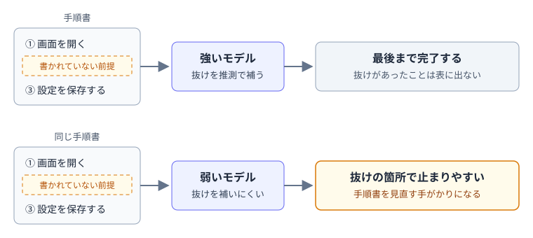

---
html:
  embed_local_images: true
  embed_svg: true
  offline: true
  toc: true
export_on_save:
  html: true
---

# 弱いモデルだって使い道がある

## きっかけ

### 性能の低いAIを、手順書の検査に使う

SNS上で、性能の低いAIを手順書の検査役として使う、という使い方が紹介されていました。  
AIの性能は高いほど良いと考えがちですが、低い方が役に立つ場面もある、という例です。  

今回は、この使い方を手がかりに次の点を整理します。  

- 性能の高いモデルと低いモデルで、手順書の抜けの見え方が違う理由
- 書いた本人には見えにくい「書かれていない前提」とは何か
- 性能の低いモデルが詰まったときの受け止め方

### 投稿の内容

投稿者は、性能の高いAIに手順書や作業の流れを書かせ、それを性能の低いAIに渡して実行させていました。  

性能の高いAIなら1時間ほどで終わる作業を、性能の低いAIは何時間もかけ、エラーを直しては詰まることを繰り返していました。  
投稿者はこれを失敗とは捉えず、手順書の出来を確かめる検査として役に立つと気づいた、と書いています。  
性能の低いAIでも最後まで進められるなら手順書は十分に分かりやすく、詰まるならそこに書かれていない前提が残っている可能性が高い、という見方です。  

:::source
guansi（X、2026年6月22日）
<https://x.com/guansi/status/2068920975547060689>
:::

## なぜ弱いモデルが役に立つのか

### 強いモデルは、抜けを補って進む

手順書に書かれていない部分があっても、性能の高いモデルは前後の文脈から推測して補い、そのまま作業を終えられることがあります。  
結果だけを見れば問題なく終わっているので、手順書のどこに抜けがあったのかは表に出てきません。  

性能の低いモデルは、推測で補える範囲が狭くなります。  
書かれていないことは分からないまま、その箇所で作業が止まりやすくなります。  
止まった場所が、手順書に足りない情報のありかを示してくれる、というわけです。  

### 開発元も、モデルによる差を前提にしている

Anthropicは、Claudeに作業手順を教える「skills」の書き方をまとめた公式ドキュメントで、使う予定のすべてのモデルで試すよう案内しています。  
そこでは、モデルごとに次のような確認の観点が挙げられています。  

- Haiku（高速・低コスト）: 十分な手引きになっているか
- Sonnet（バランス型）: 明確で効率的か
- Opus（高い推論能力）: 説明しすぎていないか

そのうえで、Opusで完璧に動く手順でも、Haikuではもっと詳しい説明が必要になる場合がある、と書かれています。  
同じ手順書でも、読み手となるモデルによって足りる・足りないが変わるということです。  

:::source
Anthropic「Skill authoring best practices」
<https://platform.claude.com/docs/en/agents-and-tools/agent-skills/best-practices>
:::

:::note
skillsは、繰り返し行う作業の手順を、AIが参照できる形でまとめておく仕組みです。
:::

## 書いた本人には見えない前提

手順書に抜けが残る原因の多くは、書いた人にとって当たり前すぎて、書く必要があると気づかない前提です。  

- どの画面・どの場所から始めるか
- 事前に済ませておく準備
- 「いつもの設定で」の「いつもの」の中身

書いた本人が読み返すと、頭の中の知識が自然に抜けを埋めてしまうため、こうした抜けは見つけにくくなります。  
性能の高いモデルが抜けを補って進んでしまうのと、同じ構図です。  

これはAIに渡す手順書に限った話ではなく、人が読む手順書や引継ぎメモにも当てはまります。  
自分で読み返して問題がなくても、前提を共有していない読み手には伝わらない部分が残っている可能性があります。  

## 詰まった原因は、手順書とは限らない

ただし、性能の低いモデルが詰まった原因が、いつも手順書にあるとは限りません。  
モデル自体の能力が足りず、手順書が十分でも進めない場合もあります。  
元の投稿でも、原因の大半は手順書側にあるだろう、という書き方に留めています。  

詰まった箇所は「見直す候補」として扱い、本当に足りない情報があるかは人が確かめる、という使い方が現実的です。  

性能の高いモデルは、多くの作業を速く確実に進めてくれます。  
一方で、推測で補わずに止まる性質が役に立つ場面もあります。  
モデルの強さは、作業の目的に合わせて選ぶものの1つです。  

:::warning
業務でのAI利用は各所属のルールに従ってください。
:::
