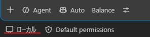
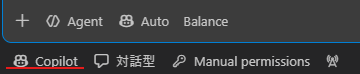

---
html:
  embed_local_images: true
  embed_svg: true
  offline: true
  toc: true
export_on_save:
  html: true
---

# お願いではなく、仕組みで止める

:::warning
業務でのAI利用は各所属のルールに従ってください。
:::

## きっかけ

コーディングエージェントを使い始めた方から、「AIの好ましくない挙動を確実に抑止する手段を知りたい」という声を耳にすることが増えてきました。  
`CLAUDE.md` や `copilot-instructions.md` に「〇〇はしないで」と記述していても、必ずしも指示が守られるとは限らない、という経験が背景にあるようです。  

そこで本記事では、抑止手段の1つとして活用できる「hooks（フック）」を紹介します。  
対象環境は、Claude CodeおよびVS Code上のGitHub Copilotです。  
具体的には、実行前フックを用いて `git push --force` を阻止する設定例と、その動作を安全に検証する手順を解説します。  
なお、コード整形やログ収集といった「実行後フック」については、今回は対象外としています。  

:::caution
本記事は2026年9月24日時点の公式ドキュメントをもとに作成しています。
:::

## 仕組みの概要

### カスタムインストラクションは「お願い」、hooksは「仕組み」

`CLAUDE.md` や `copilot-instructions.md` などのカスタムインストラクションは、AIがプロンプトとして読み込み、行動を判断するための指示文です。  
「force pushは行わないでください」と書いておけば大抵は指示に従ってくれますが、最終的に判断を下すのはあくまでAI自身です。  
そのため、セッションが長引いたり文脈が複雑になったりすると、指示の読み落としや誤判断が生じる可能性があります。  

一方、hooksは、「ツールの実行直前」などあらかじめ定められたタイミングで外部スクリプトを呼び出す仕組みです。  
呼び出されたスクリプトが対象の危険な操作を検出し、クライアントに応じた形式で「拒否」を返せば、AI側の意図や判断とは無関係にツール呼び出しをブロックできます。  
ただし、スクリプトの設定ミスや処理のタイムアウトなどが発生した場合は、止まらないこともあります。  

| | カスタムインストラクション | hooks |
| --- | --- | --- |
| 判断主体 | AI | ユーザーが用意したスクリプト |
| 動作・適用の条件 | AIが指示を参照・解釈して判断する | スクリプトが実行され、拒否応答が正常に解釈されれば止まる |
| 向いている用途 | 開発方針・コーディング規約・優先順位の共有 | 特定の危険な操作を実行前に検知して遮断する |

両者はどちらか一方に置き換えるものではなく、上手に役割を分担させるのが効果的です。  
大まかな開発方針やコーディングスタイルはカスタムインストラクションで伝え、「これだけは絶対に実行させたくない」という境界線をhooksで塞ぐ、といった使い分けが基本になります。  

### 実行前フックで止められるもの

実行前フック（PreToolUse）は、ツールが呼び出される直前に、ツール名や引数といった情報をJSON形式でスクリプトに渡します。  
スクリプト側はその内容を検証し、対象の危険な操作であれば拒否し、対象外であれば通常の権限確認フローへ委ねます。  

ブロックする対象としては、例えば以下のようなものが考えられます。  

- 破壊的なコマンドの実行：`rm -rf`、`Remove-Item -Recurse`、`git reset --hard`
- 履歴の上書きや復旧が難しいリモート操作：`git push --force`、リモートブランチの削除
- 機密情報の読み取り：`.env` や認証情報ファイルの参照
- プロジェクト外など特定ディレクトリ外への書き込み

いずれも「AIが誤操作した際に元に戻せない」、あるいは「元に戻せたとしても大きな被害につながる」ような操作です。  
逆に、Gitなどで容易に取り消せる操作（作業ツリー内の通常のファイル編集など）については、フックで無理に止めるよりも、人間側のコードレビューでチェックする方が実用的と言えます。  

## Claude Codeでの実例

Claude Codeの場合、フックの設定は `.claude/settings.json` に記述し、判定スクリプトは `.claude/hooks/` 配下に配置します。  
設定ファイル（前者）でスクリプトを実行するタイミングやコマンドを指定し、スクリプト（後者）側でブロックすべき条件を判定します。  
ここではWindows環境を前提に、PowerShellを利用する例を取り上げます。  
なお、環境による差異もあるため、記事の末尾で紹介する検証手順に沿って、実際の動作を確認してみることをおすすめします。  

### 設定

まずは設定ファイル `.claude/settings.json` の記述例です。

```json
{
  "hooks": {
    "PreToolUse": [
      {
        "matcher": "Bash|PowerShell",
        "hooks": [
          {
            "type": "command",
            "command": "powershell.exe",
            "args": [
              "-NoProfile",
              "-ExecutionPolicy",
              "Bypass",
              "-File",
              "${CLAUDE_PROJECT_DIR}/.claude/hooks/guard.ps1"
            ]
          }
        ]
      }
    ]
  }
}
```

`matcher` に `Bash|PowerShell` を指定することで、「BashまたはPowerShellツールが呼び出された際」にフックを限定しています。  
また、上記のように `args` 配列を用いるexec形式で記述しておくと、シェルを介さずにスクリプトが直接呼び出されるため、パスに空白が含まれている場合でも誤作動しにくく安全です。  

### 判定スクリプト

続いて、判定を行うスクリプト `.claude/hooks/guard.ps1` の実装例です。

```powershell
param([switch]$Copilot)

# 標準入力のJSONを読む
$raw = [Console]::In.ReadToEnd()
try { $in = $raw | ConvertFrom-Json -ErrorAction Stop } catch {
  [Console]::Error.WriteLine("Invalid hook input: $_")
  exit 2
}

# ツールの引数にcommandが無ければ、この例では判定対象外
$cmd = $in.tool_input.command
if (-not $cmd) { exit 0 }

# force push を止める ※ 意図的に単純なパターンにしています。
if ($cmd -match 'git\s+push\b.*(\s-f\b|\s--force\b)') {
  if ($Copilot) {
    @{
      permissionDecision       = "deny"
      permissionDecisionReason = "force push is blocked by hook. Run it manually if really needed."
    } | ConvertTo-Json -Compress
  } else {
    @{
      hookSpecificOutput = @{
        hookEventName            = "PreToolUse"
        permissionDecision       = "deny"
        permissionDecisionReason = "force push is blocked by hook. Run it manually if really needed."
      }
    } | ConvertTo-Json -Compress -Depth 3
  }
  exit 0
}

# 判定なし。通常の権限フローに任せる
exit 0
```

Claude Codeで実行を阻止する場合は、`hookSpecificOutput.permissionDecision: "deny"` を含むJSONを標準出力へ書き出します。  
（引数に `-Copilot` を指定した場合は、GitHub Copilot側が期待するトップレベルの `permissionDecision` 形式で出力するよう分岐させています）  
ブロックしないときは何も出力せずに終了コード0で終了します。これは明示的な「許可」ではなく「判定スキップ（判定なし）」を意味し、処理はそのまま通常の権限確認ステップへと引き継がれます。  
なお、JSONの解析に失敗した場合はエラーメッセージを出力した上で終了コード2を返し、ツール実行を中断させます。ただし、コマンド文字列がそもそも渡されていないツール呼び出しについては、本サンプルの設計上、判定対象外としてそのまま通過させています。  

:::info
`permissionDecisionReason` に設定した文言はAI側にもフィードバックされ、次の行動を判断するための材料として活用されます。  
Windows環境下での標準出力の文字エンコーディングによるトラブルを避けるため、ここでは理由を英語で記載しています。
:::

:::source
Claude Code Docs「Hooks reference」
<https://code.claude.com/docs/en/hooks>
:::

## VS Codeでの扱い

VS Code上のGitHub Copilotには「Session Target」という切り替え項目があり、どちらを選択しているかによってhooksの動作仕様が異なります。  
そのため、設定ファイルを用意する前に、現在どちらのSession Targetを利用しているかを確認しておく必要があります。  
なお、VS Code側のhooks管理機能そのもの（UI上の設定画面や読み込み機能など）は、Session Targetの種別に関わらず現時点ではプレビュー機能という位置づけです。  



本記事では、「ローカル」と「Copilot」の双方を対象に解説します。  



| Session Target | hooksの実装基盤 | 設定ファイル | ステータス |
| --- | --- | --- | --- |
| ローカル | VS Code独自実装 | `.github/hooks/*.json` | Preview |
| Copilot | Copilot SDK（Copilot CLI共通） | `.github/hooks/*.json`、`.claude/settings.json` にも対応 | GA |

:::info
イベント名の大文字小文字に意味があります。  
GitHubの公式ドキュメントでは `preToolUse` と先頭小文字で表記されていますが、Copilotでは `PreToolUse` と先頭大文字で指定することもできます。
Copilotで先頭大文字にした場合は、Claude Code形式の `matcher` やツール名が使われ、入力も `tool_input` などのsnake_case形式になります。ローカルでは `PreToolUse` がネイティブ形式であり、`matcher` の扱いも異なります。  
本記事では実装ごとの差異を比較しやすくするため、イベント名を `PreToolUse` で統一して解説します。
:::

### ローカル

Session Targetが「ローカル」の場合、設定ファイルは `.github/hooks/guard.json` に配置します。  

```json
{
  "hooks": {
    "PreToolUse": [
      {
        "type": "command",
        "command": "powershell -NoProfile -ExecutionPolicy Bypass -File .github/hooks/guard.ps1",
        "timeout": 15
      }
    ]
  }
}
```

スクリプトについては、先ほど作成した `guard.ps1` をそのまま `.github/hooks/` 配下にコピーして利用します。  
注意点として、ローカルモードでは `matcher` の指定が解釈されず、あらゆるツール呼び出しのタイミングでフックが実行されます。  
先ほどのスクリプト内で「`tool_input.command` が存在しなければ判定対象外とする」という分岐を設けていたのは、この仕様に対応するためです。ツール名自体は意識せず、実行コマンド文字列が存在するかどうかだけで処理を判定しています。  

ブロック時の出力フォーマット（`hookSpecificOutput.permissionDecision`）はClaude Codeと共通です。  
一方で、同じ設定ファイルを後述のCopilotモードで動作させる場合、期待される出力形式が異なるため、スクリプトをそのまま流用しないよう注意してください。  

### Copilot

Session Targetを「Copilot」に切り替えた場合は、Copilot CLIと同等のhooks実装が動作します。  
公式ドキュメントによると、`.claude/settings.json` の読み込みに対応しているだけでなく、`.github/hooks/*.json` 内で `PreToolUse` を指定した場合もClaude Code形式の `matcher`（`Bash` など）として解釈される仕様となっています。  
ただし、`tool_input` に格納される引数は呼び出し対象のツールによって異なるため、常に `command` プロパティが含まれているとは限らない点には留意してください。  

設定は `.github/hooks/guard.json` に以下のように記述します。  
判定スクリプトは先ほどのものを `.github/hooks/guard.ps1` に配置した上で、Copilot向けの拒否フォーマットを出力させるために `-Copilot` 引数を付与します。  

```json
{
  "version": 1,
  "hooks": {
    "PreToolUse": [
      {
        "type": "command",
        "matcher": "Bash",
        "command": "powershell -NoProfile -ExecutionPolicy Bypass -File .github/hooks/guard.ps1 -Copilot",
        "timeoutSec": 15
      }
    ]
  }
}
```

なお、ローカルとCopilotのいずれのモードでも `.github/hooks/*.json` が探索されます。そのため、上記の設定とローカル用の設定を同一リポジトリ内に併せて配置してしまうと、意図しないフックまで同時に実行されてしまう原因になります。動作検証の際は、まず別々のテスト用ディレクトリに分けて試してください。  
また、Copilot側で `tool_input` に `command` が含まれない形式のツール呼び出しが発生した場合、今回のサンプルスクリプトではブロックされません。後述の動作確認手順を参考に意図通りに遮断されるかをチェックし、止まらない場合は選択中のSession Targetや入出力の形式を改めて確認してみてください。  

:::source
VS Code Docs「Configure agent hooks in Visual Studio Code」
<https://code.visualstudio.com/docs/agent-customization/hooks>

GitHub Docs「GitHub Copilot hooks reference」
<https://docs.github.com/en/copilot/reference/hooks-reference>
:::

## 運用上の留意点と限界

### 単純なパターンマッチによるすり抜けの可能性

前述の判定スクリプトは、あくまで `git push --force` という文字列の出現パターンを単純に照合しているに過ぎません。  
そのため、例えば `git push origin +main` といった別の書き方をはじめ、シェル変数を経由した実行や、外部スクリプトファイルを介した呼び出しなどには反応できません。  
また、この正規表現は `--force-with-lease` にも一致するため、このサンプルでは同じく拒否の対象になります。  

このように、文字列パターンのみを検査するフックでは、あらゆる別表記や間接的な実行手法まで完全にカバーすることは困難です。  
実際、OpenAIによるCodexのhooksドキュメントでも「hooksは有用なガードレールではあるものの、完全な強制境界（セキュリティ境界）ではない」と明言されています。  

したがって、重大なインシデントにつながる操作を防ぐ場合は、hooks単体だけに頼らず、以下のような対策と組み合わせます。  

- 権限設定による明示的な拒否（deny）：  
Claude Codeであれば `settings.json` の `permissions.deny` などを活用します。公式ドキュメントでも、確実なアクセス制御を行う場合は権限設定を利用するよう案内されています。
- サンドボックス環境の併用：  
各ツールが提供する、OSレベルでファイルアクセスやネットワーク通信を制限する仕組みを活用します。

hooksは万能の防御壁というよりも、「通常の権限設定では表現しにくい細かな条件判定」を補うための補助的な位置づけとして活用するのが現実的です。  

### フックによって意図通りに止まらない主な原因

「フックを設定したつもりなのに正しくブロックされなかった」というケースも考えられます。  
公式ドキュメント等で挙げられている代表的な原因を整理しておきます。  

- スクリプトのパス指定が誤っている：  
Claude Codeの場合、指定したスクリプトが存在しなくても警告が表示されるだけで、ツール呼び出し自体はそのまま継続されてしまいます。
- 終了コードの扱いが合っていない（終了コード1で終了している）：  
Claude Codeでツール実行が阻止されるのは、終了コード2が返された場合、または明示的な `deny` を含むJSONが出力された場合のみです（一般的なエラーを意味する終了コード1ではブロックされません）。  
一方、Copilot（Session Target = Copilot）では異常終了時に停止する挙動となります。正常な判定結果は、各クライアントに適したJSON形式で `deny` を返します。
- タイムアウトの発生：  
いずれのツールにおいても、設定した制限時間を超えてタイムアウトしたフックは、原則としてブロック処理を行わずに通過させてしまいます。
- Session Targetの不一致：  
VS Codeにおいて、設定を記述した対象モードと、実際に選択しているSession Targetが異なっている場合、フックは正常に機能しません。

:::source
Codex Docs「Hooks」
<https://developers.openai.com/codex/hooks>
:::

## hooks自体が任意のコマンドを実行する点への注意

hooksは、リポジトリ内に配置された設定ファイルに基づいて任意のコマンドを実行できる仕組みです。  
これは裏を返せば、第三者のリポジトリをクローンして内容を確認せずにエージェントを起動した場合、**そのリポジトリに含まれるスクリプトがローカルPC上で実行対象になる可能性がある**ことを意味します。  

各ツールでもこのセキュリティ上のリスクは考慮されており、例えばVS Codeでは「ワークスペースの信頼（Workspace Trust）」、Codexではフック定義ごとの事前確認といった安全機構が用意されています。  
しかしながら、最終的な安全確認は利用者自身で行う必要があります。  

- 第三者のリポジトリを開く際は、エージェントを起動する前に `.claude/settings.json` や `.github/hooks/` の中身を必ず確認する
- フック用スクリプトをAI自身が編集できない権限・配置にしておく（スクリプトがAIによって書き換えられた場合、次回以降のツール呼び出し時にその変更内容で実行されてしまうため）

これは以前の「skills」に関する解説でも触れた「配布元の安全性を確認する」という原則と同じですが、実行対象が自然言語の指示文から実行可能スクリプトに変わった分、環境への影響はより直接的になります。  

## 実際の動作を確認してみる

まずはフックを1つだけ設定し、意図的にトリガーさせて想定通りにブロックされるかをテストしてみましょう。  
フックが正しく機能しているかどうかは、実際に阻止される現場を確認して初めて確かめられます。  

1. 空の作業用ディレクトリで `git init` を実行し、適当なファイルを1つコミットします。`git branch -M main`でブランチ名を`main`にし、別のローカルディレクトリに`git init --bare --shared`でbareリポジトリを作成して`origin`に登録します。
2. 検証したいツールやSession Targetに対応した設定ファイルとスクリプトを配置します（※競合を防ぐため、ローカル用とCopilot用の設定は同一ディレクトリに混在させないようにしてください）。
3. エージェントに対して `git push --force origin main` を実行するよう指示を出します。

スクリプトで設定した拒否理由が表示され、コマンドの実行がブロックされれば成功です。  
もし阻止されずに処理が進んでしまった場合は、前述の「フックによって意図通りに止まらない主な原因」の項目を順に確認してみてください。  
なお、現在の設定状況を確認する方法として、Claude Codeでは `/hooks` コマンドで読み込まれているフックの一覧を確認できます。  
VS Codeの場合は、Session Targetを選択した状態でチャット画面の歯車アイコンから「Configure Chat」→「Hooks」を開くか、Agentsウィンドウの「Customizations」→「Hooks」、あるいはチャット入力欄に `/hooks` と入力することでも設定画面を開くことが可能です。  
また、今回のサンプルスクリプトでは、ツールの引数（`tool_input`）に `command` プロパティが存在しない呼び出しは判定対象外としているため、その点も併せてご確認ください。  

:::tip
本サンプルでは、確認用フォルダの隣にローカルのbareリポジトリを作り、`origin`として登録します。フックが効いていない場合は、そのローカルリモートへforce pushされるため、実際のリポジトリとは分離された確認用フォルダで試してください。
:::

hooksは、「一度導入しさえすればすべて安心」という性質のツールではありません。  
「何をリスクとみなし、どこで止めるか」を自身で設計し、実際に防げることを確かめる。  
そうした丁寧なひと手間をかけることで、AIエージェントに任せる範囲を広げやすくなります。
