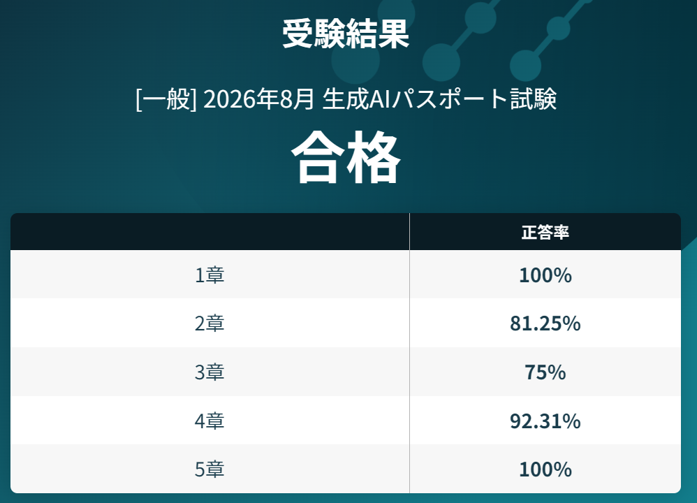
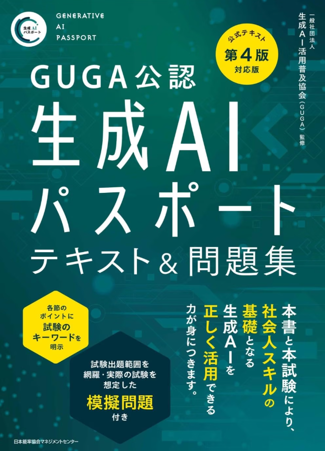

---
html:
  embed_local_images: true
  embed_svg: true
  offline: true
  toc: true
export_on_save:
  html: true
---

# 生成AIパスポート受験記

生成AIパスポートを受験して合格したので簡単な記録を共有します。



## 生成AIパスポートとは

### そもそも何？

そもそも生成AIパスポートとは何なのか、
[公式ページ](https://guga.or.jp/generativeaiexam/)
より引用します。

```txt
生成AIパスポートは、生成AIリスクを予防する日本最大級（※）の資格試験です。
生成AIに関する基礎知識や動向、活用方法に加え、情報漏洩や権利侵害などの注意点まで網羅し、AI初心者が最低限押さえておきたいリテラシーを体系的に習得できます。
※2025年11月時点で発表されている生成AI関連の資格試験や検定の受験者数に基づく
```

簡単に言えば、「生成AIに関する超基本的な知識・リテラシーを身に着けることができる」試験です。

### 難易度はどれくらい？

合格率8割越えで、資格試験の中では簡単な部類になります。
2026年8月1日（土）〜8月31日（月）に開催された試験では以下のような内訳でした。

- 受験者数: 約3.2万人
- 合格者数: 約2.5万人

累計だと以下のような内訳です。

- 累計受験者数: 14.8万人
- 累計有資格者数: 11.8万人

### 次回開催はあるの？

2026年最後の開催は10月に予定されています。  
申込期限は9月一杯なので、気になる方はお早めに…!!  

- 開催形式　：オンラインでの実施（IBT方式 ※1）
- 試験時間　：60分間
- 問題数　　：60問
- 出題範囲　：シラバスより出題
- 受験資格　：制限なし
- 受験費用　：11,000円（税込）
- 受験期間　：2026年10月1日（木）0:00〜10月31日（土）23:59
- 申込期間　：2026年8月1日（土）0:00〜9月30日（水）23:59

※1：IBT方式とは、Internet Based Testingの略称で、インターネットを経由して実施する試験やeラーニングの総称

## どんな準備をしたのか・感触

### 対策

以下テキストを一周なぞりました。休憩時間にサラサラ読んで、合計3, 4時間くらいです。  
Udemyの模擬試験も試すつもりでしたが、実施せずです。



:::note
IBT方式の試験によくある受験日申込のような仕組みがなく、
マイページからシームレスに受験できてしまうので注意です。

私はWebページをさまよっているうちに試験開始してしまったので、そのまま受けました。
:::

### 当時の感触

過去のモデルの特徴とか覚える意味ないだろって読み飛ばしていた内容がチラホラ設問にあったので、五分五分くらいかなと思っていました。  

## その他

### おススメ度

G検定 か 生成AIパスポート のどちらか1つを受けるとしたら、G検定の方がいいかもしれません。  
また、単にAIを使うことを重視するなら、今になってこの2つのどちらも受ける必要はないかなぁという印象です。  

時間が有り余っていて両方とも受けたいって場合は、生成AIパスポート ⇒ G検定 の順で受けると、ステップアップを感じられると思います。

### ザックリとした違い

- G検定:  
　AIに関する動向・機械学習・ディープラーニングに関する割と具体的な内容。  
　密度は濃いが、別にこれらの詳細を知らなくたってAIは利用できる。  
　私の受験した当時はまだAIの実装が身近にあっていずれ自分でも実装を。。。って気持ちにもなりましたが、  
　今ほど高性能になってくるともはや手が届かないので、自分事として捉えられない気がする。

- 生成AIパスポート:
　シラバスに記載されている内容を薄く扱う内容。  
　AIよく使っている人やネット・AIリテラシーを備えている人なら難しくない。  
　先述したように過去モデルの紹介もされているので、そうした内容も暗記したいのならいいかもしれないが、  
　私はそうしたものにあんまり価値を感じない（ふんわり把握しておいて必要な場面があれば具体的に調べればいい）ので、微妙感。  

### 資格試験以外に

もっと基礎を身に着けたい、ちょっと力試ししてみたいって方は以下のようなモノもあります。  
タダで試せるので、受験料がハードルに感じる方は以下でも十分だと思います。

- [AIスキル検定](https://ai-skill-kentei.jp/blog/about-ai-skill-kentei-shokyu/)
- [ASKラーニング](https://ai-skill-kentei.jp/learning/)
