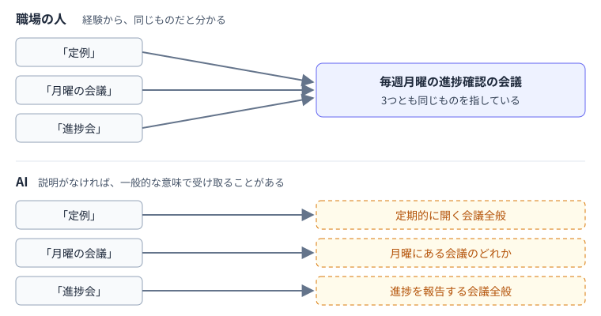
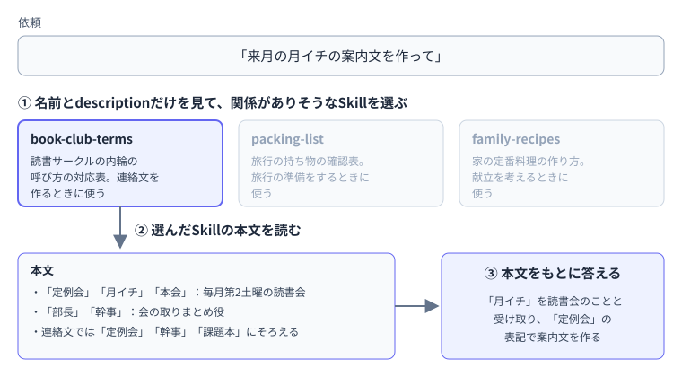

---
html:
  embed_local_images: true
  embed_svg: true
  offline: true
  toc: true
export_on_save:
  html: true
---

# その呼び方、AIは知っていますか

## きっかけ

### GeminiのGemが、Skillに置き換わる

GoogleのGeminiで、指示を登録しておける「Gem」が「Skill」に置き換わることが発表されました。  
切り替えは個人アカウントから2026年11月に始まり、Google Workspaceのビジネス・エンタープライズ・非営利組織向けは2027年3月、教育機関向けは2027年6月の予定です。  
既存のGemは、切り替えの際に自動でSkillへ変換されます。  

今回は、Skillの使いどころの1つとして「社内の呼び方をAIに伝える」場面を取り上げ、次の点を整理します。  

- 同じものを人や部署によって別の名前で呼ぶ「表記ゆれ」が、AIとのやり取りで何を起こすか
- 毎回説明する代わりに、まとめて渡しておく入れ物としてのSkill
- Skillの最小限の書き方と、AIを使わずにできる下準備

:::source
Gemini アプリ ヘルプ「Transition from Gems to skills」
<https://support.google.com/gemini/answer/18560919>

ITmedia NEWS「Geminiの『Gem』廃止へ、11月17日から『スキル』へ刷新」（2026年9月29日）
<https://www.itmedia.co.jp/news/article/2609/29/2000001839/>
:::

### 各社で共通の形になりつつある

Skillという形は、Geminiだけのものではありません。  
AnthropicのClaudeやGitHub Copilotでも、同じくSkillという名前の仕組みが使われています。  

これらの製品では、`SKILL.md`という1つのファイルを中心に、名前・説明・指示をまとめる形が使えます。  
細かな仕様は製品ごとに違いますが、基本の形は共通しています。  
そのため、1つの製品で書き方を覚えておけば、ほかの製品でも応用が利きます。  

:::source
Anthropic「Agent Skills」
<https://platform.claude.com/docs/en/agents-and-tools/agent-skills/overview>

GitHub Docs「Adding agent skills for GitHub Copilot」
<https://docs.github.com/en/copilot/how-tos/copilot-on-github/customize-copilot/customize-cloud-agent/add-skills>
:::

## 同じものに、いくつもの呼び方

### 表記ゆれは、どこにでもある

職場では、同じ部署や書類、作業を、人によって違う名前で呼んでいることがよくあります。  
正式名称、略称、昔の名前、チーム内だけのあだ名などが混在している状態です。  

業務をAIで扱おうとする現場でも、これが課題として挙がっています。  
人同士であれば、文脈や「ああ、あれのことね」という経験で補えます。  
新しく来た人も、しばらく働くうちに自然と覚えていきます。  

:::source
ヘッドウォータース「散らばった業務知識を GitHub Copilot Skill でOntologyで整理する」（2026年9月29日）
<https://speakerdeck.com/headwaters/chirabata-gyoumu-chishiki-o-github-copilot-skill-de-ontology-de-seiri-suru?slide=15>
:::

### AIは、社内だけの呼び方を知らない

AIは膨大な文章から学習していますが、社内だけで使われている略称やあだ名の意味まで学習しているとは限りません。  
知らない言葉を受け取ったAIは、聞き返すとは限らず、一般的な意味で解釈して答えを組み立てることがあります。  

たとえば、社内で特定の会議を「定例」と呼んでいても、AIにはどの会議のことか分かりません。  
社内の一部門を略称で呼んだ場合も、同じ略称を持つ一般的な用語として受け取られることがあります。  
返ってきた答えは自然な文章なので、取り違えに気づきにくい点にも注意が必要です。  



これを避ける方法の1つは、AIに頼むときに「ここで言う〇〇は△△のことです」と説明を添えることです。  
ただ、毎回同じ説明を書くのは手間がかかり、書き忘れも起きます。  

## Skillにまとめて渡しておく

### Skillの中身

Skillは、AIに渡しておきたい説明や手順を、ひとまとまりにしておく入れ物です。  
ファイルとして用意する場合は、フォルダの中に`SKILL.md`というファイルを置く形が基本です。  

`SKILL.md`は、大きく次の3つでできています。  

| 項目 | 書くこと |
| --- | --- |
| 名前（name） | Skillを区別するための名前。ここでは英小文字とハイフンで書く（例：`book-club-terms`） |
| 説明（description） | このSkillが何のためのもので、どんなときに使うのか |
| 本文 | AIに伝えたい内容そのもの |

この中で、descriptionは特に大切な役割を持っています。  
たとえばClaudeでは、最初に名前とdescriptionを読み、今の依頼に関係があると判断したSkillの本文を読み込みます。  
Copilotも、依頼とdescriptionをもとにSkillを選び、選んだSkillの本文を読み込みます。  
descriptionに「何のためのものか」と「どんなときに使うか」の両方を書いておくと、必要な場面で使われやすくなります。  



社内の呼び方をまとめたSkillを用意しておけば、依頼のたびに説明を書かなくても、関係する場面でAIがその内容を参照できるようになります。  
実際に使うには、利用する製品に応じた配置や登録が必要です。ここでは、その前段階として対応表の書き方を紹介します。  

### 書き方の例

架空の読書サークルを例に、内輪の呼び方をまとめた`SKILL.md`を示します。  

```markdown
---
name: book-club-terms
description: 読書サークル「積読を崩す会」で使っている内輪の呼び方の対応表。積読を崩す会の連絡文や予定を作るとき、会の中の呼び方が出てきたときに使う。
---

# 積読を崩す会の呼び方

## 同じものを指す呼び方

- 「定例会」「月イチ」「本会」：毎月第2土曜に開く読書会のこと
- 「部長」「幹事」：会の取りまとめ役のこと。会社の役職ではない
- 「課題本」「今月の本」：次の定例会までに読む本のこと

## 文章を書くときのルール

- 連絡文では「定例会」「幹事」「課題本」にそろえる
```

先頭の`---`で囲まれた部分に名前とdescriptionを書き、その下に本文を書きます。  
本文は、ふつうの箇条書きで十分です。  

この例の「部長」のように、一般的な意味も持つ言葉は、説明がないとAIがそちらの意味で解釈することがあります。  
「会社の役職ではない」のように、取り違えやすい意味を打ち消す一言を添えておくと伝わりやすくなります。  
また、呼び方の対応だけでなく「どの呼び方にそろえるか」を書いておくと、AIが文章を作るときの表記も統一できます。  

## 試してみる

もし興味があって時間もあれば、紙やメモ帳で試してみるといいでしょう。  
AIを使わない範囲での実践例です。  

1. 自分の周りで、同じものを2通り以上の名前で呼んでいる言葉を3つほど書き出す。
2. それぞれの言葉について、事情を知らない人が聞いたらどう受け取りそうかを一言添える。
3. 書き出した内容を、下の形に当てはめてみる。

```markdown
---
name: （英小文字とハイフンで、内容が分かる名前）
description: （何のための対応表か）。（どんなときに使うか）。
---

# （タイトル）

## 同じものを指す呼び方
- 「呼び方A」「呼び方B」：（指しているもの）

## 文章を書くときのルール
- （そろえたい呼び方）
```

手順1で言葉が思い浮かばないときは、職場の会議や書類の呼び方、家族の中だけで通じる言い方などを思い返してみてください。  
手順2で「誤解されそう」と感じた言葉は、取り違えを打ち消す一言を添える候補です。  

書き出してみると、自分では当たり前に使っていた呼び方に、説明がないと通じないものが意外と混じっていることに気づくかもしれません。  
ここで作ったメモは、Skillを作るときや、AIに社内の呼び方を説明するときの下書きとして使えます。  

:::warning
業務でのAI利用は各所属のルールに従ってください。
:::
